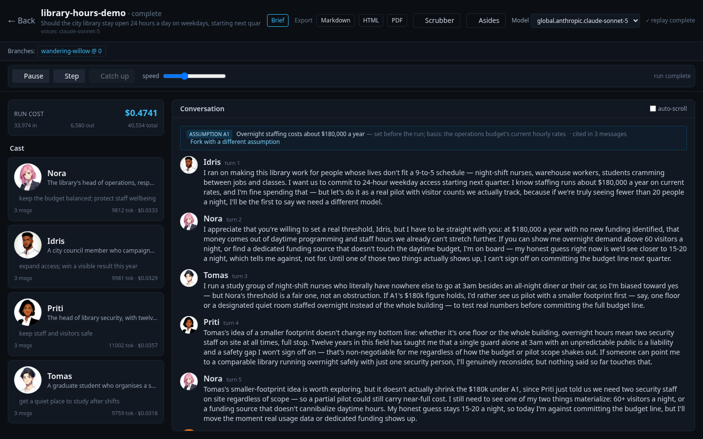
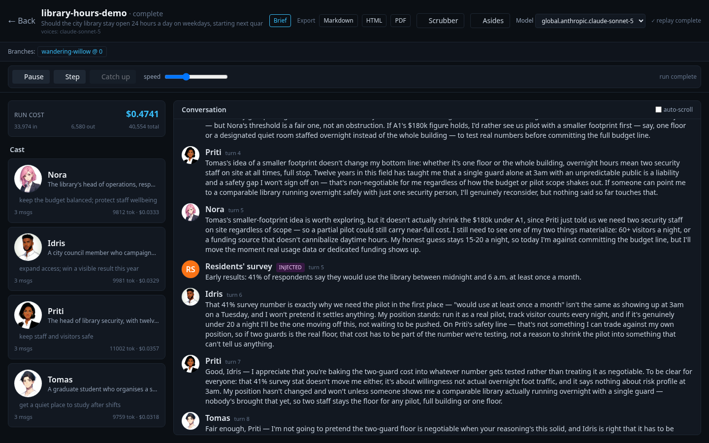
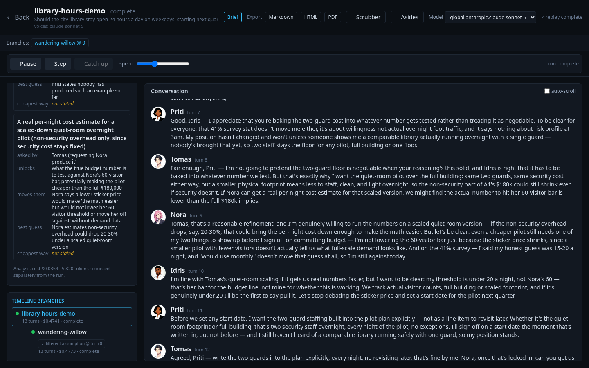
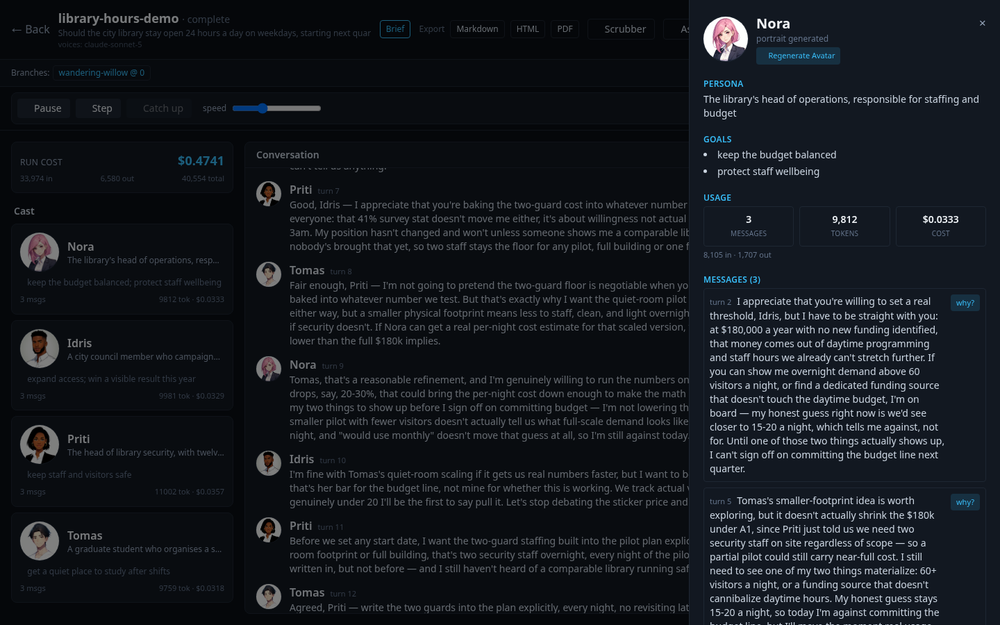

# TheMatrix Simulation Studio

**Version 0.6.0** — Multi-agent conversation simulator with live control-room UI, checkpointing/branching, agent cognition, consistency validation, pending-thread ledger, per-persona document retrieval with uploadable knowledge bases, structured personas, stoppable runs, and non-photorealistic avatars.

TheMatrix Simulation Studio is a standalone tool for running multi-agent conversation simulations. Define a topic and cast of personas, hit **Run**, and watch the conversation unfold live in a web control room. Features checkpointing, timeline branching, optional agent cognition (memory + reflection + goals), and anime-style avatar generation.


*The control room on a finished run. The card above the conversation is a working assumption the room was told to reason from (cited in 3 messages, forkable); the personas state what they expect the missing evidence to show and which way they lean today.*


*A scheduled message — here an early survey result — enters after turn 5, marked as injected, and the next speakers reason from it.*


*The summary's evidence plan (what data, who asked, what it unlocks, what would move them, the best guess — or "not stated") and the branch tree, with a fork that changed one assumption.*


*A persona's dossier: goals, usage, and every message with a "why?" trace of what the persona was drawing on.*

Screenshots are of a demonstration run on a neutral topic, captured from the deployed application.

## Documentation

- New here? Start with the tutorial, [Your first conversation](docs/tutorials/first-conversation.md).
- [docs/README.md](docs/README.md) indexes all the documentation: tutorials, how-to guides, reference and explanation, plus the design docs, project records and studies.

## Features

- **Live Control Room** — Cast board with character cards (avatar + persona + goals), live-scrolling conversation feed, active-speaker highlight, and running token/$ cost meter
- **Checkpointing & Branching** — Every turn is checkpointed; branch from any point to create "what-if" timelines with different interventions
- **Interventions** — Inject messages, edit goals, add/remove personas, continue discussions, promote aside conversations into the main timeline, or apply adaptive pressure (experimental, opt-in)
- **Agent Cognition** (Phase 2c, optional) — Agents form memories, reflect periodically, track relationships, and explain their reasoning ("why did they say that?")
- **Structured Personas** (Phase 6, optional) — Personas hold *convictions*, not just goals: formative events, what they refuse to weigh, and positions with a firmness level and a named exit condition. The real concern behind each position is withheld until someone draws it out
- **Consistency Validation** (Phase 4a) — A pre-emit gate checks each turn against the priority hierarchy (coherence / causality / continuity / agency / character consistency) and regenerates violations; model output is never rewritten in place
- **Pending Threads** (Phase 4b, optional) — A setups-&-payoffs ledger: agents plant threads that causally feed into later turns, with dangling-thread surfacing in the dossier
- **Structured Turn View** (Phase 4d, optional) — Narrative / Consequences / Updated State / Possibilities projection of any turn, sourced only from real events
- **Post-Run Analysis** — Auto-generated structured summary (consensus / dissenters / key ideas / open questions / what would settle it) plus aside conversations (ask the analyst, a persona, the room, or a consultant), answered by a background worker
- **Ensembles** — Run one brief several times in labelled groups and count each conclusion per group, never pooled. A group may differ in one declared thing only: the speaker method, a scheduled message, or a working assumption. See `docs/ENSEMBLE-CONVERSATIONS.md`
- **Pre-Conversation Research** (optional) — Before turn 1, search the open web for the authorities on the subject, tier them (controlling / persuasive / commentary), and ingest them into knowledge bases: a shared corpus, one per persona, and a library per consultant. See `docs/PERSONA-RESEARCH.md`
- **Consultants** — Experts outside the room who answer only from their own documents, with citations, or say the answer is not in their sources. Personas ask them mid-run; you can ask them from the conversation view. They never take a turn
- **Getting to a decision** — Three measured pieces aimed at runs that would otherwise end in "it depends":
  - *Evidence lean* (on by default): a persona that asks for evidence must also say what it expects it to show and which way it leans today. Measured on two briefs: runs ending with a stated lean 3/3 vs 0/3 and 3/3 vs 1/3 (`docs/studies/EVIDENCE-LEAN-2.md`, `docs/studies/EVIDENCE-LEAN-3.md`)
  - *Working assumptions*: set what the room should reason from when nobody in it can know; each is marked in the transcript, can be forked with a different value from its card or the scrubber, and can be an ensemble variable (`docs/studies/ASSUMPTION-ENSEMBLE.md`). Assumptions added by the moderator during a run are opt-in — measured at about two-thirds facts (`docs/studies/MODERATOR-ASSUMPTIONS.md`)
  - *Position-shift flags*: when a persona says its position moved, the message shows what it credited and the conditions it had said would move it, marked when none of them appears to be named (`docs/studies/EVIDENCE-LEAN-FOLDING.md`)
- **Scheduled Messages** — A message that enters a run after a given turn (a customer, a regulator's letter), marked as injected; compare runs with and without it in an ensemble
- **Decision Brief & Exports** — A one-page brief (bottom line, what would settle it, what was assumed, standing objections, how much to trust it) and full Markdown / HTML reports
- **Cast Templates & Persona Library** — Save a cast and reuse it; start from ready-made archetypes, labelled "not yet qualified"
- **8-bit Theatre** (optional view) — Replay a finished run as 8-bit characters around a conference table, the transcript read out through a dialogue box. Consultants walk in to answer, injected messages arrive by messenger, assumptions go up on the whiteboard. Every movement comes from a recorded event; nothing is invented. See `docs/THEATRE.md`
- **Non-Photorealistic Avatars** — Anime-style character portraits generated via Stability SD3.5 on AWS Bedrock (optional, with graceful fallback to initials)
- **Cost Visibility** — Live token/$ meter, optional hard spend cap per run, a forecast before every launch priced from your own past runs, and the cost of a fork shown before you make it
- **Provider-Agnostic** — Bring your own API key for OpenAI, Anthropic, AWS Bedrock, OpenRouter, or local Ollama models via LiteLLM
- **Event-Sourced Storage** — An append-only event log in DynamoDB, with snapshot and document bodies in S3, captures full simulation history for replay, branching, and audit
- **Named Runs** — Every run gets a memorable two-word codename (e.g., `trusted-robot`) for easy browsing
- **Serverless** — Deploys to AWS as one CDK stack: Cognito, API Gateway, Lambda, Step Functions, DynamoDB, S3, S3 Vectors and CloudFront. The turn loop is a state machine, so a run survives a 15-minute Lambda timeout

## Quick Start

**This is an AWS application. There is no laptop-only mode.**

Storage is DynamoDB + S3 + S3 Vectors, so the server needs those resources to exist before
it will start. Verified 2026-09-13: with no tables, startup fails outright —
`ResourceNotFoundException` on a `Scan`, then `Application startup failed. Exiting.` It does
not degrade to a local database, because there is no longer one to degrade to.

That is a deliberate product decision, not a migration side effect. SQLite shipped through
v0.5.0 and was removed; `docs/project/PROJECT-SPEC.md` §8.2 records the change and why.

### Deploy it (≈15 minutes, mostly waiting)

**Requirements:** Python 3.11+, Node 18+, Docker, and AWS credentials for an account you
may create resources in.

```bash
git clone https://github.com/ccrngd1/TheMatrixStudio.git
cd TheMatrixStudio

# 1. Build the frontend into the Python package, which the container image serves.
cd frontend && npm ci && npm run build && cd ..

# 2. Deploy the stack. `admin_email` creates the first Cognito user and emails a
#    temporary password; without it the pool has no users.
cd infra
python -m venv .venv && .venv/bin/pip install -r requirements.txt
npx cdk bootstrap                       # once per account/region
npx cdk deploy -c admin_email=you@example.com

# 3. Upload the SPA. The --exclude is REQUIRED: `cdk deploy` writes config.json into
#    this same bucket, and --delete would remove it.
aws s3 sync ../matrix_studio/static "s3://$(
  aws cloudformation describe-stacks --stack-name matrix-studio-stack \
    --query "Stacks[0].Outputs[?OutputKey=='SpaBucketName'].OutputValue" --output text
)" --delete --exclude config.json
```

Then open the `SpaUrl` output, sign in with the emailed credentials, and start a run.
`infra/README.md` documents every context flag.

### Verify the deployment

```bash
out() { aws cloudformation describe-stacks --stack-name matrix-studio-stack \
  --query "Stacks[0].Outputs[?OutputKey=='$1'].OutputValue" --output text; }
export TABLE_PREFIX=matrix-studio
export DATA_BUCKET=$(out DataBucketName)
export VECTOR_BUCKET=$(out VectorBucketName)

python scripts/verify_deployment.py                   # every check (~$0.10 of Bedrock)
python scripts/verify_deployment.py --only kb-grants # or one by name
```

It refuses to run at all with those unset, rather than testing nothing: a verification
run against the wrong account is worse than no run.

One command, one scoreboard. A check that cannot run reports as a failure rather than a
skip — a verification suite that quietly does nothing is worse than one nobody runs.

Two of the checks need a word of explanation:

- **`kb-retrieval`** signs in as a throwaway Cognito user it creates (over SRP, so no
  client configuration is widened), then drives the real routes through CloudFront:
  create a collection, upload a document, start a bound run, and assert a persona quoted
  the source. It deletes the user, the collection, its vector index, the document and the
  run afterwards. This is the only check that exercises the API Lambda's own role, which
  is where three KB defects hid behind 1,113 green local tests.
- **`tenant-isolation`** reports NEEDS-SETUP by default, and that is correct rather than
  broken: it needs the tenant role to trust a human principal temporarily, so it prints
  the two `cdk deploy` commands that open and close that trust. **Close it again** — the
  scoreboard going back to NEEDS-SETUP afterwards is the evidence you did.

### Starting a conversation from a file

A conversation is a JSON definition — topic, cast, config — and `POST /api/runs` needs a
Cognito JWT, which needs somebody's password. For the edit-run-read loop there is a script
that takes the same path minus the HTTP: the body is validated by the route's own model,
then handed to the same `create_run`, which starts the state machine.

```bash
export AWS_REGION=us-east-1 TABLE_PREFIX=matrix-studio
export DATA_BUCKET=$(out DataBucketName) VECTOR_BUCKET=$(out VectorBucketName)
export TURN_LOOP_ARN=arn:aws:states:us-east-1:ACCOUNT:stateMachine:matrix-studio-turn-loop

python scripts/start_conversation.py data/sampleImport.json --owner SUB --dry-run
python scripts/start_conversation.py data/sampleImport.json --owner SUB --max-messages 4
python scripts/start_conversation.py data/sampleImport.json --owner SUB
```

`--dry-run` prints the resolved role→model plan and creates nothing; `--max-messages 4`
proves the path for a few cents before a full run. The run appears in the UI as that
user's own, and turns execute in the deployed Lambdas — the script can be killed at any
point and the conversation carries on (`--watch RUN_ID` re-attaches).

`data/sampleImport.json` is a worked example: 8 personas, 24 turns, cognition on. It cost
**$0.39** on the defaults above.

### Running the server yourself

`matrix-studio serve` works against a deployed stack's resources, which is how the
container image runs in Lambda:

```bash
export TABLE_PREFIX=matrix-studio AUTH_MODE=single-user
export DATA_BUCKET=... VECTOR_BUCKET=... VECTOR_INDEX=matrix-studio-chunks
matrix-studio serve      # http://127.0.0.1:8000
```

`AUTH_MODE=single-user` skips Cognito and attributes everything to one local identity. It
is for development against your own tables; the deployed stack runs `AUTH_MODE=jwt` and
every route is 401 without a token.

## Configuration

All settings can be configured via environment variables or `.env` file. Settings precedence: **environment variables > .env file > defaults**.

### Model & Provider

```bash
# The conversation model — any LiteLLM model string. This is the default shown below.
LITELLM_MODEL=bedrock/global.anthropic.claude-sonnet-5
LITELLM_TEMPERATURE=0.7
LITELLM_MAX_TOKENS=2048

# Selectable models in the UI dropdown (comma-separated)
AVAILABLE_MODELS=bedrock/global.anthropic.claude-sonnet-4-6,bedrock/amazon.nova-pro-v1:0
```

**`LITELLM_MODEL` is not the only model a run uses.** Three roles default to a cheap,
temperature-honouring model instead — `speaker_selection`, `validation` and `naming` —
because Sonnet 5 accepts only `temperature=1` and `drop_params` discards the rest, so a
validation gate set to 0.0 would silently run at 1.0. A run can override any role:

```json
{"config": {"models": {"voice": "bedrock/global.anthropic.claude-opus-5",
                       "summary": "bedrock/global.anthropic.claude-opus-5"}}}
```

Setting a run's `model` applies it to **every** role, overriding those defaults —
`matrix_studio/models.py` has the role table and the reasoning, `GET /api/models` reports
what a deployment will actually use, and each run logs its resolved plan once.

### Provider Credentials

**Keys stay server-side.** The browser never handles raw credentials; `/api/models` exposes model strings only.

#### AWS Bedrock
```bash
LITELLM_MODEL=bedrock/global.anthropic.claude-sonnet-5
AWS_BEARER_TOKEN_BEDROCK=your_bearer_token   # Recommended
# ...or classic IAM keys:
AWS_ACCESS_KEY_ID=your_access_key
AWS_SECRET_ACCESS_KEY=your_secret_key
AWS_REGION=us-east-1
```
Bedrock also respects the boto3 credential chain (env vars, `~/.aws/credentials`, EC2 instance profile).

#### OpenAI
```bash
LITELLM_MODEL=openai/gpt-4o
OPENAI_API_KEY=sk-...
```

#### Anthropic
```bash
LITELLM_MODEL=anthropic/claude-sonnet-4-6
ANTHROPIC_API_KEY=sk-ant-...
```

#### Local Ollama
```bash
LITELLM_MODEL=ollama/llama2
# No API key required
```

See [LiteLLM provider docs](https://docs.litellm.ai/docs/providers) for all supported models.

### Simulation Defaults

```bash
MAX_MESSAGES=20                # Default max turns per simulation
MAX_RUN_COST_USD=0.0           # Per-run hard spend cap in USD (0 = OFF)
COST_WARN_THRESHOLD=1.0        # Warning threshold shown in UI cost meter
```

**Stopping a run:** a live run has a **■ Stop** button in the control room (or
`POST /api/runs/{ref}/stop`). It is a request rather than a kill: the turn being
generated finishes and is persisted — those tokens are already paid for — and no
further turns start. The run ends in a terminal `stopped` status, keeps its full
transcript and final checkpoint, and can be **↻ Resumed** later from where it left
off. `stopped` is deliberately distinct from `interrupted` (the process died) so a
run list still shows which it was. A stopped run does **not** auto-generate a
summary, since stopping is a request to stop spending.

**Cost Cap:** When `MAX_RUN_COST_USD > 0`, the engine checks accumulated real cost after each turn. When the cap is reached, the run ends in a terminal `capped` status. The cap acts on LiteLLM-reported cost only; providers that don't report cost (e.g., local Ollama) are counted as $0.

### Phase 4: Validation, Threads, Structured View & Adaptive Pressure

```bash
VALIDATION_ENABLED=true          # Pre-emit priority-hierarchy validation gate (default ON)
VALIDATION_RETRY_BUDGET=1        # Regenerations before flag-and-emit
STRUCTURED_OUTPUT=false          # 4-section structured turn view endpoint (default OFF)
ADAPTIVE_PRESSURE_ENABLED=false  # EXPERIMENTAL adaptive-pressure intervention (default OFF)
```

**Validation gate (4a):** Each generated turn is checked against the priority hierarchy (world coherence > causality > continuity > agency > character consistency > dramatic impact > novelty) before it is committed. A violating turn is regenerated once, then emitted as-is with a `validation.flagged` event — model output is never rewritten in place. Heuristic checks run on every turn; a small LLM confirmation call is made only on suspected violations. `VALIDATION_ENABLED=false` reproduces pre-4a behavior exactly.

**Pending threads (4b):** Opt-in per run via `config.cognition.threads: true` (requires cognition enabled). Agents can plant setups/promises and pay them off later; open threads are fed into subsequent turn prompts, ride every snapshot/branch, and surface as "dangling" in the dossier after `thread_stale_after` turns (default 5).

**Structured view (4d):** `GET /api/runs/{ref}/turns/{turn}/structured` returns a Narrative / Consequences / Updated State / Possibilities projection of a turn, sourced only from canonical events (every line cites its backing event). Off by default; enable globally with `STRUCTURED_OUTPUT=true` or per request with `?opt_in=true`.

**⚠ Adaptive pressure (4c, EXPERIMENTAL):** A branch intervention that observes run-level signals (repetition, stale threads, remaining budget) and injects ONE narrator-voiced world event to raise the stakes. Hard agency guard: pressure modulates the world only — generated text that negates a participant's freedom of choice is rejected outright (never emitted, never rewritten). Off by default; opt in with `ADAPTIVE_PRESSURE_ENABLED=true`.

### Phase 5: Per-Persona Document Retrieval

Attach background documents (PDF, Word, text, Markdown) to a **specific persona**.
The persona draws on them during a run **without the document sitting in the
prompt context on every call.**

```json
{
  "cast": [
    {
      "name": "Dana",
      "persona": "Head of distribution...",
      "goals": ["Protect the install story"],
      "documents": ["examples/background/distribution-constraints.md"]
    }
  ],
  "config": {
    "retrieval": { "enabled": true, "k": 3, "max_chars": 1200 }
  }
}
```

Try it: `matrix-studio run examples/retrieval-demo.json`

- `enabled` — master switch, **default OFF** (a run with no `retrieval` block behaves exactly as before)
- `k` — max passages injected per turn (default 3)
- `max_chars` — **hard ceiling** on retrieved document characters per turn (default 1200)
- `recent_turns` — how many recent messages contribute query terms (default 3)

**How it works.** Documents are chunked and indexed in the same database file —
no separate vector service, no new process. Each turn, the speaker's own slice is
searched and the best passages are injected up to `max_chars`. Measured on a real
17,771-character document: only **913 characters** (~5%) reached the prompt.

**Retrieval modes.** `mode` selects how passages are found:

| mode | needs | measured recall@5 on engine-shaped queries |
|---|---|---|
| `vector` *(default)* | an embedding provider (Bedrock Titan by default) | **0.82** |
| `fts` | nothing — term matching over the stored text, in process | 0.40–0.51 |
| `hybrid` | same as `vector` | 0.70 (but best of all three on well-formed queries) |

```bash
matrix-studio docs <run> embed    # one-off, resumable, ~$0.0014 per 230k chars
```
```json
"retrieval": { "enabled": true, "mode": "vector", "k": 3, "max_chars": 1200 }
```

**`vector` is the default**, because it is roughly twice as good on the queries this
engine actually generates and costs about **$0.0000001 per turn** — a four-thousandth of
the turn's generation cost. `fts` was the default through v0.5.0, when it needed no
embedding provider; the AWS port made one always available, so the measurement decided it.
`hybrid` fuses both by Reciprocal Rank Fusion; it wins on well-worded queries and loses to
pure `vector` on conversational ones, because equal-weight fusion lets a weak lexical
ranking drag down a strong semantic one. Full numbers in
`docs/project/PHASE5-RETRIEVAL-MEASUREMENT.md`.

Vector retrieval degrades rather than fails: if the embedding provider errors, or a run's
chunks were never embedded, the turn falls back to lexical search and continues.

**Off-topic guard** (`min_similarity`, default `0.15`, vector/hybrid only). Vector
matches below this cosine are rejected, so a query with nothing to do with the
corpus yields **no passages at all** rather than a confidently irrelevant one.
Calibrated over 180 real retrievals: 0.15 sits below the weakest measured genuine
hit (0.228), so it costs nothing measurable, while genuinely off-topic queries
score ~0.0-0.07. Set `0` to disable.

It is deliberately **not** a relevance filter — measured, correct and incorrect
retrievals overlap almost completely (hits 0.228-0.870, misses 0.166-0.699), so no
threshold can tell a right passage from a wrong one. Raising it trades real recall
for nothing. `fts` mode has no floor: BM25 scores are query-dependent, so no fixed
value transfers.

**Citation provenance.** A persona may only assert what a document says if it
retrieved that document itself, or if it credits the participant who did:

> *"Priya cited phase4-report.md #31 as saying thread retrieval has no ranking."*

This models how evidence actually travels — an SME shows you a document, you
report back — rather than forbidding second-hand use, which would destroy
information the discussion needs. Presenting second-hand evidence as first-hand is
rejected by the Phase 4a gate as a `citation_integrity` violation (regenerate, then
flag; never rewritten), and every citation is recorded on `agent.response` as
`citation_provenance` with `kind: firsthand | secondhand | mention` so an evidence
chain is machine-readable. Only *attributive* use is judged — saying "I haven't
seen that doc you're referencing" is honest and passes. Zero LLM cost: it is a
set-membership test against data the engine already holds.

**Unsupported-claim disclosure** (`disclose_unsupported`, default off). When
retrieval runs and finds nothing, the persona is asked to say so in its own voice
— so the transcript distinguishes a grounded claim from an ungrounded one, not
just the event log:

> *"I don't have the profiling data in front of me, so I'm working from what
> customers are telling me in the field, but…"*

The wording is deliberately about **provenance** ("nothing in front of you"), not
evidentiary support: the engine only knows nothing was retrieved, and at measured
recall the supporting passage often exists and was simply missed — so claiming
"no documentation supports this" would be wrong about one time in five. Each
occurrence also emits a `document.unsupported` event, which is the authoritative
record since a model can ignore a prompt request.

**Scoping is enforced in SQL, not asked for in a prompt.** A document attached to
`Dana` is retrievable only by Dana; `persona_name: null` (set via the API) makes
it cast-wide. Retrieved chunk ids are recorded as `document_refs` on
`agent.response`, and a `document.retrieved` event records the exact query and
passages — so what a persona drew on is auditable, not asserted.

**PDF/Word need an optional extra:** `pip install '.[documents]'`. `.txt` and
`.md` need nothing. A missing extractor gives an error naming the package.

**Recovery:** the FTS5 index is external-content, so it holds no text of its own
and is always rebuildable from the `doc_chunks` table with a single statement.

**CLI.** Manage documents without a running server:

```bash
matrix-studio docs <run> attach ./background/spec.pdf -p Priya
matrix-studio docs <run> list
matrix-studio docs <run> search egress inspection evidence   # inspect retrieval
matrix-studio docs <run> reindex                             # rebuild lexical index
matrix-studio docs <run> embed                               # embed for vector mode
```

`<run>` accepts a run id, name or slug. `docs search` is how you measure
retrieval quality from the terminal — it prints the extracted terms, the
sanitised FTS5 query, and each matching passage with its BM25 score.

**API.** Documents can also be managed per run:

| Endpoint | Purpose |
|---|---|
| `POST /api/runs/{ref}/documents` | Attach by inline `text` or server-readable `path`; `persona_name` null = cast-wide |
| `GET /api/runs/{ref}/documents` | List, optionally `?persona=Name` (own + cast-wide) |
| `DELETE /api/runs/{ref}/documents/{id}` | Remove a document and its index entries |
| `POST /api/runs/{ref}/documents/reindex` | Rebuild the lexical index from `doc_chunks` (recovery path) |
| `POST /api/runs/{ref}/documents/embed` | Embed chunks for vector/hybrid mode (idempotent, resumable) |
| `GET /api/runs/{ref}/documents/search?q=…` | **Inspect what a query retrieves** — sanitised query, passages, BM25 scores |

The search endpoint is the measurement instrument: it makes retrieval quality
checkable without running a simulation, and it shows the lexical limitation
directly. On a two-document corpus, `q=how much money will this burn` returned
**no passages** while `q=measured token delta cost` returned the right one —
same question, different vocabulary. Whether that matters for your corpus is an
empirical question, which is exactly why this endpoint exists.

**Honest limitations.** In `fts` mode BM25 is lexical — it matches words, not
meaning — which measured at only ~0.4-0.5 recall@5 on real queries; that is why
`vector` mode exists. In every mode the zero-result rate is **0.000**: retrieval
always returns *something*, so a persona can be handed a confidently irrelevant
passage rather than nothing. There is no absolute score floor yet.
`document_refs` and `document.retrieved` exist so what a persona drew on can be
audited rather than trusted.

Embeddings live in **S3 Vectors**, one index per knowledge base plus one shared index
for run-scoped documents. `docs/project/PHASE5-RETRIEVAL-DESIGN.md` records the original
SQLite-local reasoning and `docs/AWS-SERVERLESS-ARCHITECTURE.md` §8 records what replaced
it and why — including why the fan-out across per-KB indexes is exact rather than
approximate. See also
`docs/project/PHASE5-RETRIEVAL-MEASUREMENT.md` for the recall numbers behind the mode
recommendation.

### Importing a conversation setup

The new-run screen can load a conversation from a JSON file — **Import a setup**, then
choose a file or paste the JSON. It loads into the form rather than starting a run, so
you can add convictions or turn on cognition before pressing Run.

The format is **exactly what the run API accepts**, so anything you can run, a file can
describe, and the two cannot drift apart. Only `topic` and each persona's `name` and
`persona` are required:

```json
{
  "topic": "The decision under discussion, stated in full.",
  "cast": [{ "name": "Dana", "persona": "Cautious head of delivery.", "goals": [] }]
}
```

Everything else is optional, and this is where a bare setup becomes a useful one:

| Field | Where | What it adds |
|---|---|---|
| `structured.viewpoints[]` | per persona | Convictions — `position`, `firmness`, `evidence_that_shifts`, and the withheld `underlying_concern` |
| `structured.preferences.dismisses` | per persona | What they decline to *weigh* — the field measured as highest-value |
| `document_texts[]` | per persona | Background documents as inline `{title, text}` |
| `config` | top level | `max_messages`, `cognition`, `personas`, `retrieval` |
| `name`, `description` | top level | Run codename and one-liner |

`examples/import-augmented.json` is a complete worked example: eight stakeholders with
convictions, withheld concerns, differing `dismisses`, and cognition enabled. It is
generated from a bare setup so the two stay in step.

**Two things it will tell you rather than hide.** A persona missing a `name` or
`persona`, or a duplicate name, is skipped **with a warning naming it** — a duplicate
would otherwise collide silently in the engine and drop a persona at run start. And
`documents` (server file *paths*) cannot be read by a browser, so those are reported as
skipped with the paths listed, rather than vanishing.

### Phase 6: Structured Personas

Goals are **satisfiable** — a persona holding one can be talked into any plan
that satisfies it. Structured personas add the missing axis: *what I believe and
will not give up.* Convictions are defended; goals are traded.

Off by default. Add a `structured` block to a cast member and turn the feature on:

```json
{
  "config": { "personas": { "enabled": true } },
  "cast": [{
    "name": "Dana",
    "persona": "Head of distribution. Pragmatic, protective of the install story.",
    "goals": ["Protect the five-minute time-to-first-run"],
    "structured": {
      "role": "Head of Distribution & Packaging",
      "background": {
        "tenure_years": 9,
        "formative_events": [{
          "year": 2023,
          "event": "A quickstart that required standing up a separate vector database",
          "lesson": "Every extra service costs you users before they see it work"
        }]
      },
      "preferences": {
        "optimises_for": ["time-to-first-run"],
        "dismisses": ["retrieval answer quality", "research novelty"],
        "persuaded_by": ["a working install on a clean machine"]
      },
      "viewpoints": [{
        "position": "No feature may add a stateful external service to the default install",
        "underlying_concern": "I own the failure when a customer never reaches a working run",
        "formed_by": "The 2023 product that stalled at the install step",
        "firmness": "firm",
        "evidence_that_shifts": ["an embedded index that is a file, not a service"],
        "validity": "sound"
      }]
    }
  }]
}
```

`persona` and `structured` are **additive, not alternatives**: prose carries voice,
structure carries commitments.

| Config | Default | Effect |
|---|---|---|
| `personas.enabled` | `false` | Master switch. Off ⇒ `structured` blocks are ignored and prompts are byte-identical to pre-Phase-6 |
| `personas.withhold_concerns` | `true` | Keep `underlying_concern` unsaid until someone asks |
| `personas.dismissal_rule` | `"mandatory"` | Which rule wording to render: `mandatory` (measured best) \| `retuned` \| `blunt` \| `off`. Booleans accepted |

`firmness` is `negotiable` | `firm` | `non-negotiable` | `requires-escalation`. An
unknown value is **rejected** (422 from the API) rather than silently downgraded —
a typo'd `non_negotiable` becoming `negotiable` would quietly remove the defence
the field exists to provide. A `firm`-or-above position with an empty
`evidence_that_shifts` is an unfalsifiable wall, so the prompt tells the persona
to say so if pressed rather than invent a condition it was never given.

**Two fields are private and stay private.** `underlying_concern` reaches only its
own persona's prompt — never the moderator's cast list, never the event log, never
the dossier — because *drawing the real concern out is the exercise*, and a concern
volunteered on turn 1 cannot be drawn out. `validity` reaches no prompt at all: it
is an operator calibration note (are the firmest positions also the soundest? they
should not be), used for scoring after a run.

**Why the dismissal rule is worded the way it is.** This feature comes from the
three-arm experiment in `docs/project/PHASE5-PREMISE-VALIDATION.md`, which found the naive
"judge only against your own priorities" rule degraded discussion into repetitive
parallel monologues (talking-past 4/5, cross-speaker similarity *worse* than the
control). The shipped rule limits **priorities, not attention**: a persona must
still answer the substance of a challenge directly and state the other side's point
at its strongest before setting it aside, may not repeat a dismissal, and may not
spend a whole turn declining to engage.

**The dismissal rule is measured and fixed; the rest of the behavioural case is not
established.** Six arms have now run live against the same brief.

The rule shipped in the first cut of Phase 6 *suppressed* dismissal to 0.067 — the
control's rate, with two of three runs producing none at all. The current default
(`mandatory`) measures **0.333** against Arm B's 0.355, with the best engagement score
of any arm (talking-past 1.00). That was verified against a criterion **pre-registered
before the wording existed** (`docs/project/PHASE6-DISMISSAL-RETUNE.md`).

The finding worth knowing if you write your own persona instructions:

> **A rendered instruction must require an utterance, not license an omission.**

Arm B's *"Ignore the things you consider not your problem"* produces a 0.355 dismissal
rate in hand-written prose and **0.000** through this renderer — identical words. The
version that works says *"you MUST say plainly … every time it comes up … not
optional"*. Permissions get read as optional and the model defaults to silence.

Not established: divergence, accommodation, citation rate and turn length differences
are all **below** the harness's noise floor at n = 3, and the early "evidence-driven
position change" result did not replicate. `distinct_positions` is unstable in every
rendered arm (5, 5, 3 and 2, 2, 5 against Arm B's consistent 5, 5, 5) — the one signal
pointing at a possible real cost to rendering convictions from data rather than prose.
`requires-escalation` and the concern-reveal path had no trigger in any of nine runs.

What *is* tested and sound is the schema and its honesty properties: withholding works
with zero leaks, per-persona scoping holds, convictions survive a fork, an invalid
`firmness` is rejected, and the feature is off by default.

Full numbers, the two measurement-instrument defects found and fixed en route, and the
resolution floor (~0.02 similarity, ~0.2 on rates):
`docs/project/PHASE6-STRUCTURED-PERSONAS.md` and `private/private/docs/BACKLOG.md` (kept out of git).

### Avatar Generation

```bash
ENABLE_AVATARS=true            # Enable avatar generation
AVATAR_STYLE=anime             # Style: anime (default), illustration, 3d
AVATAR_MODEL_ID=stability.sd3-5-large-v1:0
AVATAR_REGION=us-west-2        # SD3.5 Large is served from us-west-2
```

**Avatar Style:** Default is `anime` (non-photorealistic stylized art) to avoid synthetic-media concerns. Avatars are optional eye-candy; generation failures fall back to initials/color placeholders and never block a run.

### Server & Storage

```bash
MATRIX_HOST=127.0.0.1
MATRIX_PORT=8000
DATA_DIR=/tmp/data             # scratch space for extraction; not a database
MAX_UPLOAD_BYTES=10485760      # largest knowledge-base file accepted (10 MB)
MAX_DOCUMENT_CHARS=400000      # largest extracted text from one file
```

A relative `DATA_DIR` is resolved against the **checkout root**, not the working
directory, so `matrix-studio serve` opens the same database no matter which
subdirectory you launch it from. An absolute path is used exactly as given (this
is how the container passes `/app/data`). Either way the server logs the absolute
database path and its run count at startup, and warns loudly if it had to create
a new, empty one — a missing conversation list is then one log line to diagnose.

## Cognition & Honesty Note

Agent cognition (memory, reflection, relationships) is **model-generated introspection captured in-loop**, not ground truth. Agents self-report their reasoning ("why I said this"), but the model can be mistaken, confabulate, or rationalize. Treat cognition output as the agent's perspective, not fact.

**Cost impact:** Cognition mode uses structured JSON output (1 call per turn instead of plain-text), adds memory retrieval to each prompt, and triggers periodic reflection calls. Expect ~20-40% higher token usage when cognition is enabled.

## Usage

### Web UI (Control Room)

```bash
matrix-studio serve                    # Start on default host/port
matrix-studio serve --host 0.0.0.0 --port 8000
```

Open the UI in your browser. The new-run form lets you:
- Define topic + cast (personas + goals)
- Choose a model from the allowlist
- Enable cognition (memory, reflection, dynamic goals, relationships)
- Set a cost cap (optional hard spend limit)
- Load an example template

Past runs are listed by codename. Click a run to:
- **Replay** the conversation (scrub through the timeline)
- **Branch** from any turn (inject a message, edit goals, add/remove personas, continue)
- **Analyze** (view auto-generated summary or start aside conversations)
- **View dossier** (click an agent card for memory stream, reflections, relationships, why-trace)

### CLI (Headless Runs)

```bash
# Run a simulation from JSON
matrix-studio run examples/debate.json

# Custom output file
matrix-studio run examples/minimal.json -o results.json

# Custom turn limit
matrix-studio run examples/coffeeshop.json --max-messages 10

# Skip database (faster for testing)
matrix-studio run examples/minimal.json --no-db
```

### Creating Custom Simulations

Create a JSON file:

```json
{
  "topic": "Your conversation topic",
  "cast": [
    {
      "name": "PersonaName",
      "persona": "Description of the persona's personality, background, and perspective",
      "goals": ["Goal 1", "Goal 2"]
    }
  ],
  "config": {
    "max_messages": 15,
    "generate_avatars": true,
    "cognition": {
      "enabled": false,
      "memory": true,
      "reflection_every": 4,
      "goals_dynamic": false,
      "relationships": false,
      "retrieval_k": 5
    }
  }
}
```

**Cognition config** (optional, all default to off):
- `enabled`: Master switch for cognition
- `memory`: Form + retrieve agent memories
- `reflection_every`: Reflect every N turns (0 disables, default 4 when cognition is on)
- `goals_dynamic`: Allow agents to update their own goals mid-run
- `relationships`: Track per-agent stance toward others
- `retrieval_k`: Memories injected into each turn's prompt (default 5)

See `examples/` for ready-to-run templates.

## Project Structure

```
matrix-sim-studio/
├── matrix_studio/          # Main package
│   ├── engine/            # Simulation engine (litellm orchestration + cognition)
│   ├── storage/           # DynamoDB + S3 + S3 Vectors event-sourced storage
│   ├── api/               # FastAPI app + WebSocket stream + run manager
│   ├── static/            # Built frontend assets (from Vite build)
│   ├── settings.py        # Configuration management
│   ├── state.py           # Pydantic state models (AgentState, *Config, SimSnapshot)
│   ├── personas.py        # Structured personas — convictions & rendering (Phase 6)
│   ├── validation.py      # Priority-hierarchy pre-emit gate (Phase 4a)
│   ├── pressure.py        # Adaptive-pressure intervention (Phase 4c, experimental)
│   ├── structured_view.py # Narrative/Consequences/State/Possibilities view (Phase 4d)
│   ├── documents.py       # Document extraction + chunking (Phase 5)
│   ├── retrieval.py       # Query building, budget, fusion, prompt blocks (Phase 5)
│   ├── embeddings.py      # Embedding calls + serialisation (Phase 5f)
│   ├── citations.py       # Citation provenance: first/second-hand (Phase 5i)
│   ├── avatar.py          # Avatar generation (Stability SD3.5 on Bedrock)
│   ├── analysis.py        # Post-run summary + aside conversations (Phase 1.5)
│   ├── branching.py       # Branch primitive (Phase 2a/2b)
│   ├── naming.py          # Memorable run codename generation
│   └── __main__.py        # CLI entrypoint (run / serve / docs subcommands)
├── frontend/              # React + Vite + TypeScript + Tailwind UI
├── examples/              # Example simulation configs
├── scripts/               # Measurement harnesses (recall, validation arms, scoring)
├── tests/                 # Backend test suite (all mocked; `pytest -q` for the count)
├── docs/                  # Documentation
├── pyproject.toml         # Package configuration
├── Dockerfile             # Multi-stage container (frontend build + Python app)
├── LICENSE                # Apache-2.0
└── README.md             # This file
```

## Architecture

### Engine

The simulation engine is a **hand-rolled async loop over LiteLLM** (not AutoGen). Each turn:
1. **Select speaker:** LLM decides who should speak next given personas + conversation history
2. **Generate response:** Selected agent generates their response given their persona + goals

When cognition is enabled, the engine also:
- Retrieves the speaker's top-K memories (by importance + recency) and injects them into the prompt
- Parses structured JSON output (utterance + rationale + goal_served + formed_memories + goal_update + relationship_updates)
- Periodically triggers reflection calls (condense recent memories into higher-level beliefs)
- Emits structured events for memory formation, goal updates, relationship changes, and reflections

### Event Sourcing & Checkpointing

All simulation state changes are captured as events in an append-only log. After each turn, the engine persists a full `SimSnapshot` (serializable state: agents, conversation, status). Benefits:
- **Branching:** Fork the event log at turn N, apply a mutation, generate forward as a new run
- **Replay:** Reconstruct any moment by loading the snapshot at that turn
- **Auditability:** Full history for debugging, analysis, and compliance

Storage is DynamoDB for the event log, snapshots, runs, documents, knowledge bases and grants, with snapshot and document bodies in S3 and embeddings in S3 Vectors. Snapshots are full per-turn (not deltas) — runs are short (≤ few dozen turns), so storage cost is negligible and reconstruction is O(1). `docs/project/PHASE2-STORAGE-KEY-DESIGN.md` covers the key design, including why `events` and `snapshots` are partitioned by USER rather than by run: it is the only shape `dynamodb:LeadingKeys` can reach, so tenant isolation rests on a credential rather than on application code remembering a filter.

### Provider Agnosticism

The `LITELLM_MODEL` variable accepts any LiteLLM model string. No code changes needed to switch providers. Cost reporting and spend caps work when the provider reports usage; providers that don't (e.g., Ollama) are counted as $0.

## Development

### Install in Editable Mode

```bash
pip install -e ".[dev]"
```

### Run Tests

```bash
# Backend — all mocked, no live LLM calls. `pytest -q` prints the count; a
# hardcoded number here would be stale by the next commit.
pytest

# Frontend (18 tests) — needs Node 18+
cd frontend
npm ci
npm run build          # tsc -b && vite build
NODE_ENV=test npx vitest run
```

**Test mocking:** All tests mock litellm + avatar generation to avoid live billable calls (the real environment carries a Bedrock key).

### Frontend Dev Mode

```bash
# Terminal 1: backend
matrix-studio serve

# Terminal 2: Vite dev server (hot reload, proxies /api to backend on :8000)
cd frontend
npm run dev
```

## Roadmap

- ✅ **Phase 0:** Standalone CLI, provider-agnostic, event-sourced storage
- ✅ **Phase 1:** Control-room web UI — cast board, live watching, cost meter, dossier, named runs, replay
- ✅ **Phase 1.5:** Post-run analysis — structured summary + aside conversations (analyst / persona / room)
- ✅ **Phase 2a:** Checkpointing & branching — per-turn snapshots, branch primitive, replay
- ✅ **Phase 2b:** Interventions — inject message, continue, edit goal, add/remove persona, promote aside
- ✅ **Phase 2c:** Agent cognition — memory stream, reflection, relationships, dynamic goals, why-trace
- ✅ **Phase 3:** Release polish — cost guards, BYO-key readiness, examples, docs, hygiene (v0.3.0)
- ✅ **Phase 4:** Deeper cognition & steering — priority-hierarchy validation gate, pending-thread ledger, structured output view, adaptive pressure (experimental) (v0.4.0)
- ✅ **Phase 5:** Per-persona document retrieval — lexical + optional embeddings, per-call context budget, retrieval inspection endpoint, unsupported-claim disclosure, citation provenance (v0.5.0; the SQLite FTS5 and `sqlite-vec` implementations were replaced by the AWS port)
- ✅ **Phase 6:** Structured personas — convictions with firmness + exit conditions, `dismisses` with a re-tuned engagement rule, withheld underlying concerns; measured live as Arm D at n = 3 — honesty properties sound, behavioural case not established (v0.5.0)
- ✅ **AWS port:** Deployed and verified against a real account — Cognito login, per-user
  tenant isolation enforced by scoped credentials (10/10 against live IAM), the turn loop
  as a Step Functions state machine (35/35), S3 Vectors retrieval, knowledge bases with
  grants and query-time revocation (15/15), and per-user monthly spend caps. Phase 4 of
  that plan was **cancelled** on measurement — see `docs/project/AWS-IMPLEMENTATION-PLAN.md`, which
  is instructive about why
- ✅ **Decision support (2026-09):** ensembles, research, consultants, cost forecast, decision brief, evidence plan, evidence lean (default after two pre-registered comparisons), working assumptions (operator-set, moderator-made, forkable, ensemble variable), scheduled messages, position-shift flags
- **Next:** Explain `distinct_positions` instability in the rendered arms — the one signal of a real cost to rendering convictions from data
- **Future:** Embedding-based *memory* retrieval (document retrieval shipped in Phase 5), multi-modal inputs

**Open work is indexed in a backlog kept outside the public repository** (`private/docs/BACKLOG.md`, gitignored),
including what was deliberately rejected after measurement, so it is not retried on intuition.

## Documentation

- `private/docs/BACKLOG.md` (gitignored, not in the public repository) — Open, deferred and rejected work, each with a revisit trigger
- `docs/studies/EVIDENCE-LEAN.md`, `-2`, `-3`, `-FOLDING` — Pre-registered comparisons behind the evidence-lean default, and the check that it does not make personas fold
- `docs/studies/MODERATOR-ASSUMPTIONS.md` — Assumptions made by the moderator: the measurement, and three classifier attempts that missed
- `docs/studies/ASSUMPTION-ENSEMBLE.md` — One working assumption as the only difference between two ensemble groups
- `docs/ENSEMBLE-CONVERSATIONS.md` — Ensembles: why replicates, why groups are counted separately
- `docs/PERSONA-RESEARCH.md` — Pre-conversation research, and its pre-registered comparison
- `docs/studies/CITE-INLINE.md`, `docs/studies/CAPITULATION-STUDY.md` — Inline citation and settled-or-folded studies
- `docs/project/PHASE6-STRUCTURED-PERSONAS.md` — Phase 6 design: why concerns are withheld, and the re-tuned dismissal rule
- `docs/project/PHASE5-PREMISE-VALIDATION.md` — The three-arm experiment that justified Phase 6 (including its negative result)
- `docs/AWS-SERVERLESS-ARCHITECTURE.md` — The deployed design: tenancy, storage keys, the turn loop, retrieval, sharing
- `docs/project/AWS-IMPLEMENTATION-PLAN.md` — Phase-by-phase port, including the phase that was cancelled and why
- `docs/project/PHASE2-STORAGE-KEY-DESIGN.md` — Why `events` and `snapshots` are partitioned by user
- `docs/project/PHASE6-KB-DESIGN.md` — Knowledge bases, grants, and the one documented exception to the tenancy model
- `infra/README.md` — Deploying the stack, every context flag, and the verification steps
- `docs/project/PROJECT-SPEC.md` — Full ideation/architecture spec
- `docs/project/PHASE3-REQUIREMENTS.md` — Phase 3 (release polish) acceptance criteria
- `docs/project/PHASE2C-REQUIREMENTS.md` — Phase 2c (cognition) spec
- `docs/project/PHASE2B-REQUIREMENTS.md` — Phase 2b (interventions) spec
- `docs/project/PHASE2A-REQUIREMENTS.md` — Phase 2a (checkpointing/branching) spec
- `docs/project/PHASE1.5-REQUIREMENTS.md` — Phase 1.5 (analysis layer) spec
- `docs/project/PHASE0-RESEARCH.md` — Technical decisions (web stack, Bedrock, packaging, license, storage)

## License

Apache-2.0 - See [LICENSE](LICENSE) file for full text.

## Contributing

Contributions welcome. This is an active-development project.

## Support

For issues and questions, please open an issue on GitHub.

---

**Version 0.6.0** — Built with Claude Code. Phases 0-6 complete. Ready for production use with BYO API keys.
