# Mobile-first web UI: the command-centre redesign

Opened 2026-09-29. **Design only.** Nothing in `frontend/src` has changed. The design exists as a
clickable prototype, `docs/mockups/prototype.html`: one static file with invented data and no
backend, which every screenshot below was taken from. It supersedes the earlier static sketches in
`docs/mockups/mobile-ui.html`.

**The short version.** The current UI is a desktop control room and does not survive a phone. This
design keeps every feature and changes three things:

1. **Layout collapses to one column.** A run's 320 px sidebar and its feed become three tabs.
   Detail views become bottom sheets. The 1,808-line new-run form becomes a five-step wizard.
2. **Every run surface leads with a summary:** how far in, how much spent, and where the room
   stands. You can triage a run before reading a word of it.
3. **A visual system in which each colour means exactly one thing,** dressed as a sci-fi command
   centre. The dressing sits behind opaque content panels and can be switched off.

One piece is **not buildable from today's data: the live stance of each persona** (§6.1). Leans
exist only as prose; the only structured signals are position shifts and the post-run dissenter
list. The stance meter drives four surfaces in this design, so its source has to be settled, and
measured, before those surfaces ship. Everything else maps onto data the app already has.

---

## 1. Why

Measured on `frontend/src` at `f3bcec9`:

| What | Count | Consequence on a phone |
|---|---|---|
| Responsive breakpoint utilities (`sm:`/`md:`/`lg:`/`xl:`) | **3** in the whole app | Layout is fixed-width desktop. The Live view's `lg:grid-cols-[320px_1fr]` stacks the sidebar *above* the feed, so the conversation starts a screen and a half down. |
| `title=` tooltips | **75** | Phones have no hover, so all 75 explanations are unreachable. |
| `NewRunForm.tsx` | **1,808 lines**, one scrolling page | Setting up a run on a phone is a very long scroll with no sense of progress. |
| Live-view header controls | up to 7 (brief, export, stop, resume, scrubber, asides, model) | They wrap onto several lines, and Stop stops being in a fixed place. |

## 2. Design rules

These are the rules the prototype follows. They are what a reviewer should check an implementation
against.

1. **One colour, one meaning, everywhere.** See the table in §5.1. A colour is never decorative
   on a data surface.
2. **Never colour alone.** Stance is ▲ support / ◆ undecided / ▼ holding out, glyph and colour
   together. Status tags carry words. Injections carry the word "INCOMING".
3. **Summary before detail.** Every run surface opens with turn, spend and room (§4.2). Lists show
   enough to triage without opening anything.
4. **Monospace is for data, sans-serif is for prose.** Codenames, counts, costs, turn numbers and
   labels are mono. What personas say is never mono.
5. **Content sits on opaque panels.** The grid, rain, floor and scanlines show only in the gaps
   between panels. They never sit behind text. **FX** turns them off, and
   `prefers-reduced-motion` turns them off by default.
6. **Tap, never hover.** Every explanation is an ⓘ button that opens a sheet. Targets are at least
   44 px.
7. **One component tree at every width.** Wide screens rearrange the same parts: tabs become
   columns and sheets become a side panel. There is no separate desktop app to keep in step.

## 3. Information architecture

A four-item dock is the only persistent navigation: **Runs · Ensembles · Knowledge · Library**.
New runs start from a floating button on Runs and from **New ensemble** on Ensembles.

| Today | In this design |
|---|---|
| History | **Runs** tab: live, finished and branch sections plus a search |
| History (ensemble rows) | **Ensembles** tab, and also a section of Runs |
| KnowledgeBases | **Knowledge** tab |
| PersonaLibrary, CastTemplates (inside the form) | **Library** tab, and one tap from the wizard's cast step |
| NewRunForm | **Wizard**: Topic → Cast → Knowledge → Assume → Launch |
| LiveView sidebar: CostMeter, CastBoard | Header HUD (spend) and the **Cast** tab |
| LiveView sidebar: Participation, Summary, Research, BranchTree | **Analysis** tab |
| LiveView header: Brief, Export, Model, "start fresh" | **⋯** menu sheet. Stop and Resume stay in the header. |
| PlaybackControls | Mini-bar under the feed |
| Scrubber | Full-screen **Scrub** view, with the fork as a sheet |
| Dossier (modal) | Bottom sheet with four tabs |
| AsidesDrawer | Bottom sheet, laid out as a chat |
| SourceViewer | Bottom sheet, opened from a citation |

Routes are hash-based (`#/runs`, `#/run/<id>/<tab>`, `#/run/<id>/scrub`, `#/ensemble/<id>`,
`#/knowledge/<id>`, `#/new/<step>`) so the back button and deep links work. Today `App.tsx` switches
views with `useState` and has no router.

## 4. Screens

### 4.1 Runs

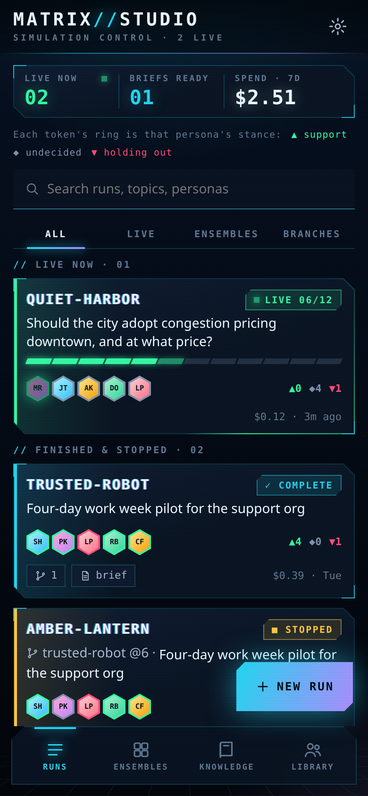

- A HUD strip shows *live now*, *briefs ready* and *spend over 7 days*.
- Cards are grouped into **Live now**, **Finished & stopped**, **Ensembles** and **Branches** (the
  last as a filter).
- Each card has:
  - a left edge in its status colour; a live card also has a light sweeping around its border;
  - a status tag, `LIVE 06/12` / `COMPLETE` / `STOPPED` / `CAPPED`;
  - turn ticks while running;
  - one **hex token per persona, ringed in that persona's stance colour**, plus ▲◆▼ counts;
  - branch count, a brief marker and a *resumable* marker when they apply.
- A one-line legend explains the rings once, at the top.

The design question behind the tokens: *can you tell which runs are converging without opening
any?* One row of rings answers it.

<br clear="right">

### 4.2 A run: header, HUD, conversation

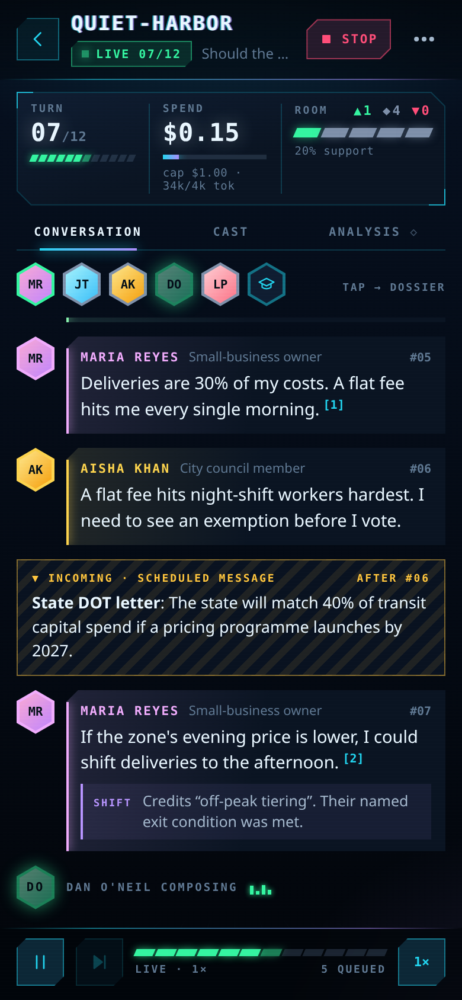

- **Header.** The codename, a status tag and the topic, truncated. **Stop** or **Resume** always
  sits in the same place, and everything else is under ⋯.
- **HUD.** Three cells:
  - **Turn:** `07/12` with one tick per turn.
  - **Spend:** the amount against the cap, a meter that turns amber at 80%, and tokens in/out.
  - **Room:** a per-persona stance bar, ▲◆▼ counts and % support.
- **Tabs.** Conversation · Cast · Analysis. Analysis shows ◇ (locked) until the run ends.
- **Face strip.** Hex tokens; the next speaker glows. Tapping one opens the dossier.
- **Messages:**
  - The speaker's colour runs down the left edge. The name is mono, then the role, then the
    zero-padded turn number.
  - Flags go under the text, each led by a word: **SHIFT** (violet, from `PositionShift`),
    **LEAN** (amber) and **ASSUMES** (cyan, tap for the assumption card).
  - Citations are `[n]` chips that open the source.
- **Scheduled messages and interventions** are hatched amber *INCOMING* banners, so they cannot be
  mistaken for speech.
- **The next speaker** shows as "*NAME* composing" with an equaliser. New messages type themselves
  in, and space for the full text is reserved so the feed never jumps.
- **Mini-bar.** Pause/play, step (enabled while paused), turn ticks, queue depth and speed.

<br clear="right">

### 4.3 Cast and the room map

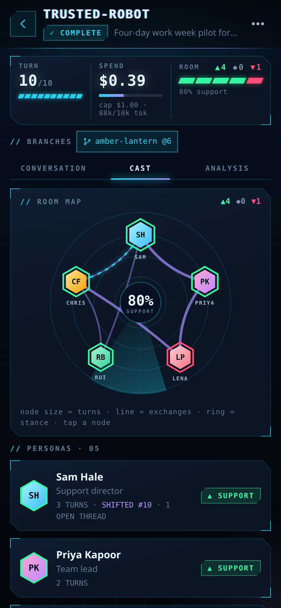

The room map is the densest single view in the design:

- **One node per persona**, placed on a ring. **Size** is turns taken. The **halo** is stance, and
  it pulses green on the next speaker.
- **One curve per pair who spoke back to back.** Thickness and opacity scale with how often they
  did. The most recent exchange is a flowing dashed line.
- **The centre** shows % support. A radar sweep is the decorative part.
- Tapping a node opens the dossier.

Below the map, each persona is a row: token, name, role, turns, *shifted at #n*, open threads and a
stance tag. The consultant appears last, labelled as never taking a turn.

What the map shows that no list does: **who is arguing with whom, and who is being left out.**
The speaker-starvation finding (Gini 0.33 before the fairness fix, BACKLOG "Speaker selection
starves participants") would have been visible at a glance as one tiny, unconnected node.

<br clear="right">

### 4.4 Dossier

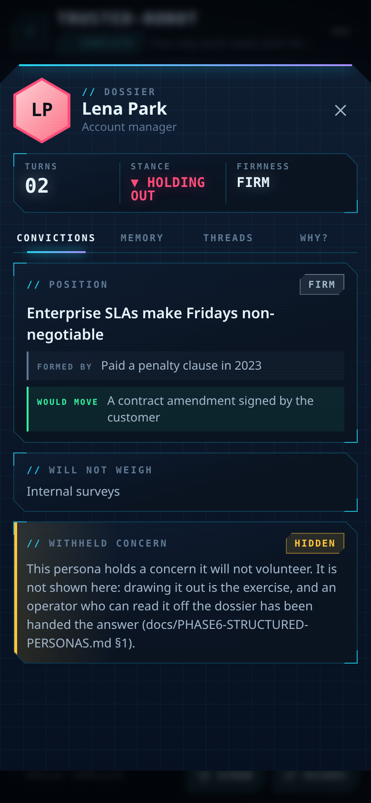

- A bottom sheet that covers the lower 92%, so the run stays visible behind it.
- A HUD with **turns, stance and firmness**.
- Four tabs:
  - **Convictions:** position, *moved @n* or firmness, **FORMED BY**, **WOULD MOVE** (the exit
    condition), *will not weigh*, and a note that a withheld concern exists, **without its
    text**.
  - **Memory:** the last three things they said, then memory stream entries and retrieved
    passages with scores.
  - **Threads:** pending threads.
  - **Why?:** the why-trace, plus their latest turn.

**The dossier never shows the concern itself.** Phase 6 forbids it: drawing the concern out is
the exercise, and "an operator who can read it off a panel has been handed the answer"
(`Dossier.tsx`, `docs/PHASE6-STRUCTURED-PERSONAS.md` §1). The mutation-tested guard stays:
`underlying_concern` and `validity` are not declared on the dossier type, so rendering them would
not compile. An early draft of this prototype did display the concern; that has been fixed. The
panel's tag says *Hidden*, not *not drawn out*, because nothing detects a reveal (Phase 6: "the
reveal path is untested").

<br clear="right">

### 4.5 Analysis

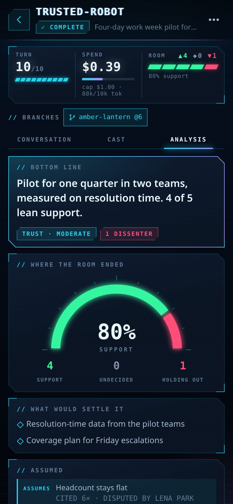

Reading order is decision first, supporting detail after:

1. **Bottom line**, in a gradient-bordered hero panel, with *trust* and *dissenter* tags.
2. **Where the room ended:** a half-dial split by stance, with % support and the three counts.
3. **What would settle it.**
4. **Assumed:** each assumption with its citation count and who disputes it, and
   **Fork with a different value**.
5. **Standing objections.**
6. Collapsible **Airtime** (bars in speaker colours), **Sources cited** (with tier) and **Branch
   tree**.
7. A thumb bar with **Asides · Scrub · Brief**.

Before the run ends the tab shows *Analysis locked*, turn progress and the live dial.

<br clear="right">

### 4.6 Scrubber and fork

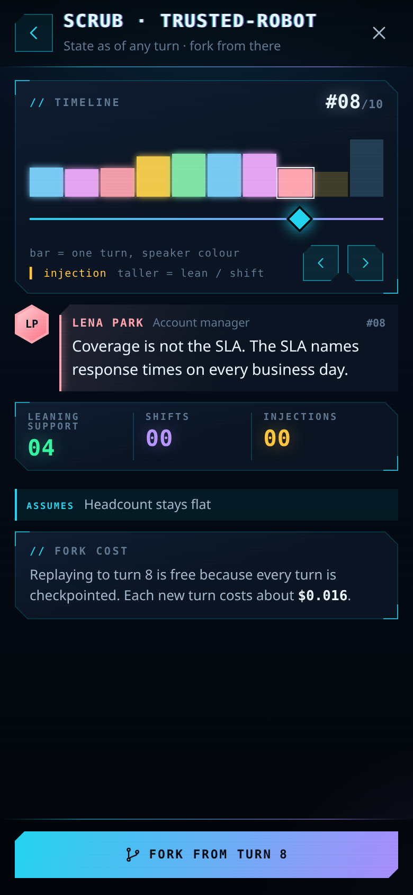
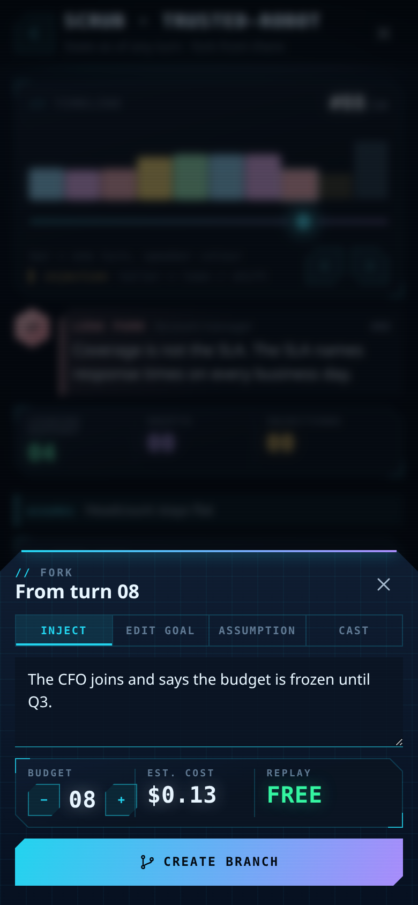

- **The timeline is a waveform:** one bar per turn in the speaker's colour, taller where that turn
  carried a lean or a shift. Injections are amber markers, and turns after the cursor are dimmed.
  A diamond-thumb slider and ‹ › step through turns.
- **Below the timeline:** the message at the cursor, a HUD of state at that turn (*leaning support,
  shifts, injections*), the assumptions in force, and the fork cost ("replay free, about $0.016 a
  turn").
- **Fork** opens a sheet:
  - pick **Inject / Edit goal / Assumption / Cast**;
  - write the text;
  - set a turn budget; the cost updates as it changes;
  - **Create branch** opens the new run, already streaming.

<br clear="right">

### 4.7 Asides

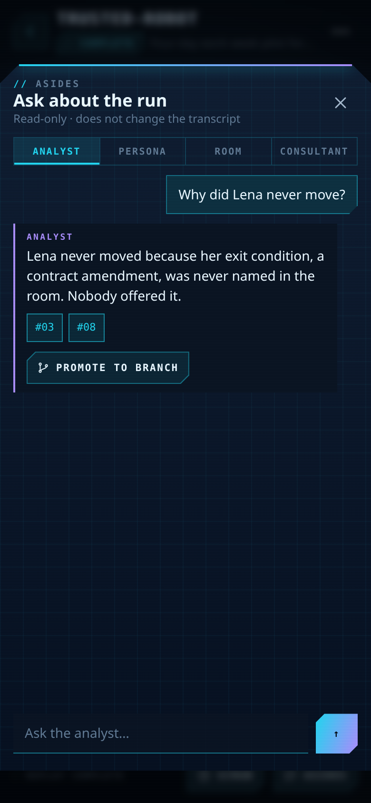

A chat laid out the way people already expect one to work:

- a target picker: Analyst · Persona (with a persona chooser) · Room · Consultant;
- your question on the right, the answer on the left, labelled with who answered;
- the turns an answer refers to as `#nn` chips that jump into the transcript;
- **Promote to branch** on every answer.

It is labelled read-only, because an aside does not change the run.

<br clear="right">

### 4.8 Ensemble

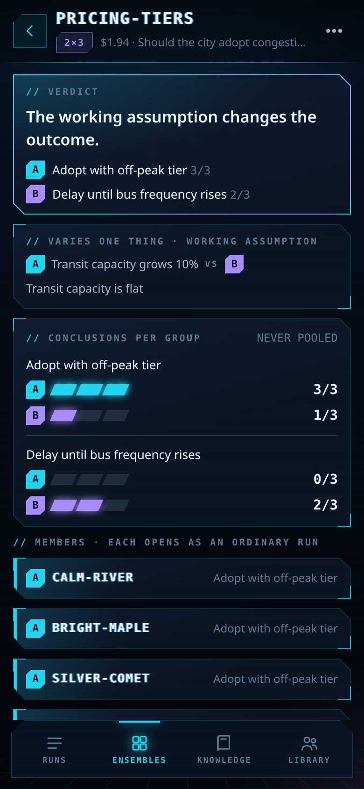

- **Verdict first:** whether the groups led with different conclusions, and each group's leader
  with its count.
- **The one declared variable**, as A vs B.
- **Conclusions per group** as slanted blocks, one per member, filled for each member that reached
  that conclusion, and marked **never pooled**.
- Members as cards that open as ordinary runs. A running member shows its live tag and the report
  panel reads "building" until every member has settled.

The verdict's wording is a design placeholder that overclaims. See §6.3.

<br clear="right">

### 4.9 New-run wizard

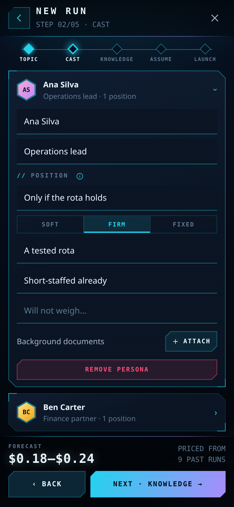
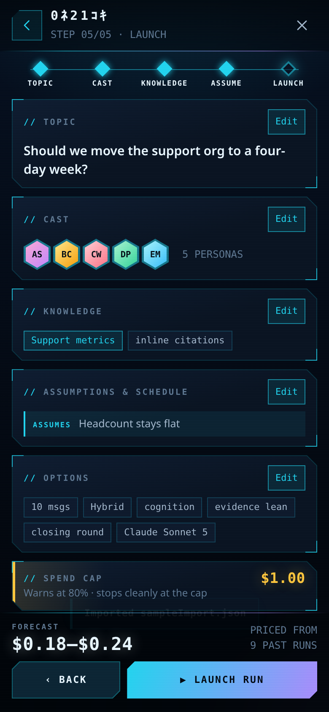

Five steps on a diamond stepper. Each step is tappable, so you can jump around.

1. **Topic:** run type (single or ensemble, with the variable, the A/B values and replicates),
   turn ceiling, convergence stop, method, closing round, cognition, avatars, model, and
   **Import a setup**.
2. **Cast:** collapsible persona cards with the structured-persona fields (position, soft / firm /
   fixed, exit condition, withheld concern, will not weigh, documents), **Draft a cast for me**,
   the library, consultants and evidence lean.
3. **Knowledge:** knowledge-base toggles, inline citations, pre-conversation research and
   per-persona research.
4. **Assume:** working assumptions, scheduled messages (drawn as INCOMING banners) and the spend
   cap.
5. **Launch:** every choice on one page, each with **Edit**.

The **cost forecast** stays pinned above the Next button on every step and updates as you type.

<br clear="right">

### 4.10 Knowledge

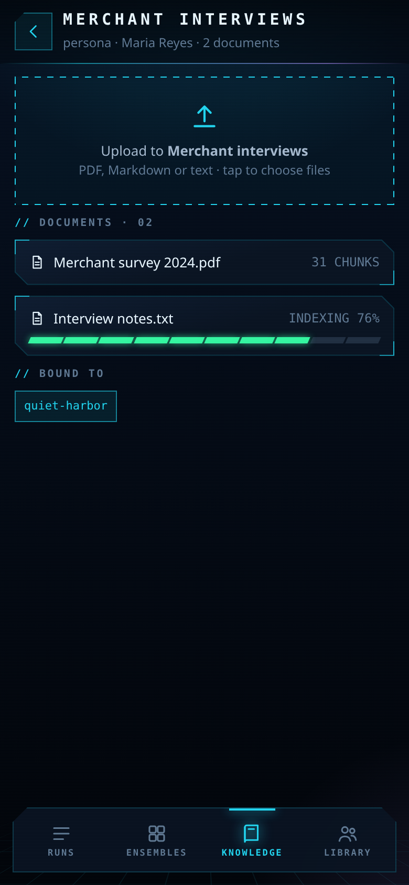

- Collections are cards showing their scope, document count, bound runs and a *ready* or
  *indexing n/m* tag.
- Inside a collection:
  - a dashed drop target that also accepts the phone's share sheet;
  - documents with chunk counts;
  - live progress ticks while indexing;
  - the runs the collection is bound to.

<br clear="right">

### 4.11 Wide layout (≥ 768 px)

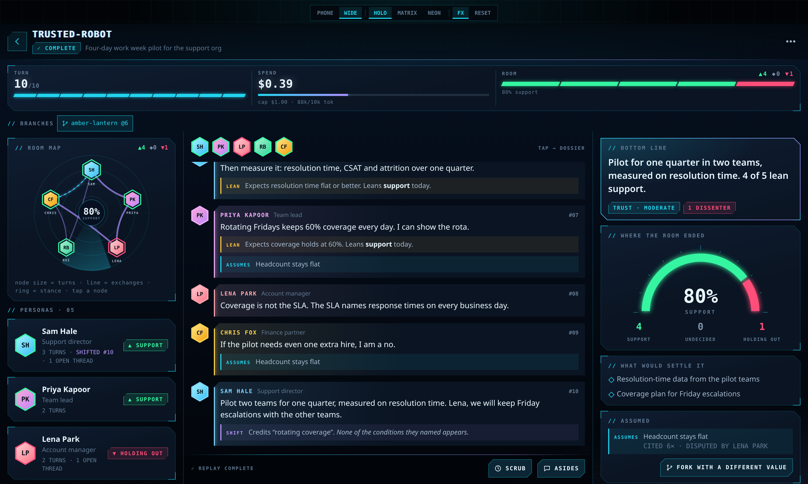

The same components rearrange:

- The three run tabs become columns: **Cast** (with the room map) · **Conversation** ·
  **Analysis**.
- Sheets become a 450 px side panel.
- Lists become a card grid.
- The dock centres.

This is the matrix theme.

### 4.12 Themes

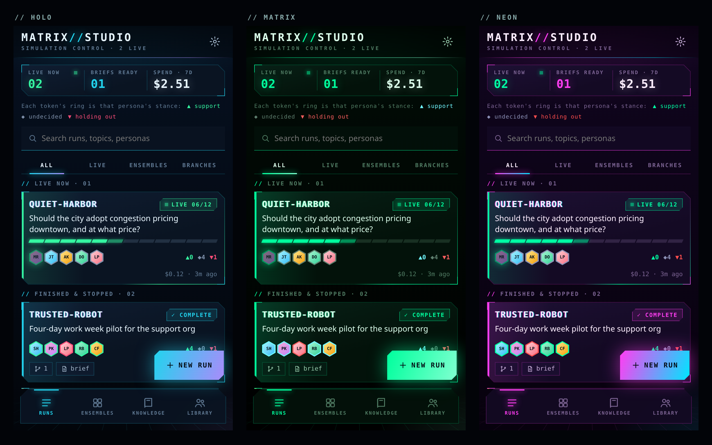

A theme swaps the palette and nothing else. **Holo** (cyan/violet) is the default. **Matrix** is
green phosphor, with support moved to cyan so that it does not collide with the accent. **Neon**
is magenta and cyan.

## 5. Visual system

### 5.1 Colour: one meaning each

| Role | Holo | Matrix | Neon | Used for |
|---|---|---|---|---|
| `accent` | `#22d3ee` | `#00ff9c` | `#ff3df2` | Interactive elements, *complete*, assumptions, brackets |
| `accent2` | `#a78bfa` | `#7dffcf` | `#00e5ff` | Ensembles, group B, gradients |
| `live` | `#34f5a0` | `#00ff9c` | `#00ffa3` | Running, next speaker |
| `support` | `#34f5a0` | `#6ff7ff` | `#00ffa3` | ▲ stance |
| `undecided` | `#7d8fa9` | `#5d7d6d` → **`#739a86`** | `#8a8fb5` | ◆ stance |
| `hold` / `danger` | `#ff4d78` | `#ff5f5f` | `#ff4d4d` | ▼ stance, Stop, capped |
| `inject` | `#ffc53d` | `#e6ff5c` | `#ffe600` | Injections, lean flags, stopped, the 80% spend warning |
| `shift` | `#b794ff` | `#c3a6ff` | `#00e5ff` | Position shifts |
| `t3` (muted text) | `#5f7892` → **`#7690ab`** | `#4f7a62` → **`#62977a`** | `#7b6392` → **`#9a80b3`** | Labels, metadata |

**Contrast, measured against the lighter panel colour.** Body text (`t1`, `t2`) is 9.0–17.9:1 in
every theme. **The prototype's `t3` fails WCAG AA** at 3.7–4.0:1, and Matrix's `undecided` at 4.2:1.
The bold values in the table pass (5.07–5.46:1) and are what an implementation should use. The
prototype still carries the failing values. Persona identity colours (the hex fills) are fixed
pastels and do not change with the theme.

### 5.2 Type

- **Prose** uses the system sans-serif at 14.5 px / 1.5.
- **Data** uses the system monospace, with tabular numerals and zero-padded counts (`07/12`,
  `#08`).
- **Labels** are mono, 10 px, tracked +0.18 em, upper-case and prefixed `// `.
- **Codenames** are mono, upper-case, with a 1 px cyan/violet chromatic split.
- There are no web fonts, because the app is served from CloudFront with nothing else.

### 5.3 Shape

- **Chamfered panels.** The top-right and bottom-left corners are cut, and HUD brackets mark the
  other two. A CSS border cannot follow a `clip-path` cut, so the element's own background *is*
  the 1 px border and `::before` paints the fill. `clip-path` also clips `box-shadow`, so glows on
  clipped shapes come from `filter: drop-shadow` on an unclipped wrapper.
- **Hex persona tokens:** pointy-top, with the ring in the stance colour (identity colour in the
  feed).
- **Slanted segments** (−24° skew) for ticks, stance bars and ensemble blocks.

### 5.4 Motion

Every loop has a period that divides 12 s, and every loop uses `animation-delay: var(--ph)`, where
`--ph` is the negative offset of the current time within 12 s, set on each render. **A re-render
therefore resumes each loop in phase instead of restarting it.** Without this, the feed's re-render
on every turn made every pulse visibly stutter.

| Loop | Period |
|---|---|
| Live-card border sweep | 4 s |
| Radar sweep | 6 s |
| Pulses | 1.5 s |
| Dashed-edge flow | 1.5 s |
| Composing equaliser | 1 s |
| INCOMING scan | 3 s |
| Button shine | 4 s |

One-shot transitions:

- the boot sequence, 1.65 s (`?noboot` skips it);
- titles decoding from glyphs on navigation;
- messages typing themselves in;
- sheets sliding up.

`prefers-reduced-motion` removes all animation. **FX** removes the rain, the floor and the
scanlines.

### 5.5 Browser floor

- `color-mix()` is used for every translucent tint: Chrome 111, Safari 16.2, Firefox 113.
- `@property` drives the live-border sweep: Chrome 85, Safari 16.4, Firefox 128. Without it the
  border is static, which is acceptable.

## 6. Derived signals: what has to be settled before building

The prototype hand-authors these signals in its mock data. Each needs a real source.

### 6.1 Stance: not buildable from today's data

The design shows every persona as *support / undecided / holding out*, live, on four surfaces: the
run card rings, the HUD room bar, the room-map halos and the Analysis dial. **The app has no such
signal.**

- **Evidence leans are prose.** `EVIDENCE_LEAN_RULE` (`personas.py`) asks personas to state a lean
  in words. It is scored offline by the eval scripts and is not stored as a field.
- **Position shifts are structured.** `Message.shift: PositionShift` (`shifts.py`) says that a
  position moved and what was credited. It says nothing about which way the persona now leans.
- **After the run**, `generate_summary` returns `dissenters: {speaker, position}[]`. That gives
  *holding out* at the end, but nothing distinguishes support from undecided.

The options, in the order to try them:

1. **Post-run only, from data that exists.** Dissenters are ▼. A persona with a recorded shift and
   not a dissenter is ▲. Everyone else is ◆, shown as "not stated" rather than "undecided". The
   run cards and the Analysis dial work on finished runs; live runs show turn and spend but no
   stance.
2. **A structured per-turn stance.** The engine or a post-turn classifier emits
   `{stance, toward}` per message. This is a classifier, and the project's own record on
   classifiers is mixed: the third attempt on unseen proposals missed its held-out target
   (`86d0a58`). It needs a pre-registered measurement against hand labels before any surface
   presents it as fact.

The prototype's own rule is: latest lean or shift wins, and a non-soft persona who has spoken
without either is *holding out*. That last clause is a guess. It must not ship.

### 6.2 Room-map edges are adjacency, not replies

A curve means *spoke back to back*, which is a proxy for *responded to*. It overstates exchanges
in round-robin phases, where adjacency is forced. The engine records no reply structure, so there
are two options. Label the map *sequence* rather than *exchanges* (cheap, and honest). Or add reply
attribution, which is a new signal carrying the same measurement burden as §6.1.

### 6.3 The ensemble verdict overclaims at n = 3

"The working assumption changes the outcome" is drawn from each group's *leading* conclusion. At
three replicates per group, 3/3 against 1/3 is suggestive, not established, and
`docs/ENSEMBLE-CONVERSATIONS.md` computes per-cell tiers precisely so that nobody reads a leader
as a result. The verdict must be worded from those tiers, for example "Groups led differently
(A 3/3, B 1/3 · n = 3 per group)", and must never say "changes" below whatever threshold the
ensemble report already uses.

### 6.4 Personas who have not spoken yet

Early in a run most personas have not spoken, and the prototype counts them as undecided, so
every run looks undecided for its first few turns. They should be a fourth, visibly different
state, *not yet spoken*, and should be left out of "% support". (The prototype's `quiet-harbor`
cast includes a persona who plays a moderator. In the app the moderator is the speaker-selection
model, not a cast member, so no correction is needed for it.)

## 7. Building it

The staging below goes cheapest first, and each stage keeps the existing 50 vitest files green.
The stack stays React + Tailwind. Tokens become CSS variables under `[data-theme]`, which Tailwind
reads.

| Stage | Contents | Depends on |
|---|---|---|
| 0 | Tokens, themes and primitives (`Panel`, `Tag`, `Hex`, `Ticks`, `Sheet`, `Hint`). No behaviour change. | — |
| 1 | Shell: dock, header, hash routes, sheet ↔ side panel at 768 px. All 75 `title=` become `Hint` taps. | 0 |
| 2 | Live view: tabs, HUD (turn and spend only), restyled feed and flags, playback mini-bar, Dossier and Asides as sheets | 1 |
| 3 | NewRunForm → wizard. The largest change: split the 1,808-line file by step and keep its 11 test files passing. | 1 |
| 4 | Scrubber waveform and fork sheet. Knowledge and Library restyle. | 1 |
| 5 | Stance surfaces (card rings, HUD room cell, room map, dial) and the ensemble verdict | **§6.1 and §6.3 decided** |
| 6 | Atmosphere (rain, floor, scanlines, boot, decode, type-in), behind FX | 0 |

### Acceptance

- No horizontal scroll at **360 px**. Every target is **≥ 44 px**. Nothing is reachable only by
  hover.
- **Every row of the §3 table is reachable.** Walk it as a checklist.
- Body and label text is **≥ 4.5:1** against its panel in every theme, using the §5.1 corrected
  values.
- Reduced motion shows no animation. FX off shows no animated background.
- A 40-turn run streaming for 10 minutes on a mid-range phone does not restart loop animations on
  re-render and does not leak listeners. The prototype's phase trick (§5.4) is the reference.

## 8. The prototype

- **Serve it:**
  ```bash
  python3 -m http.server 8765 --directory docs/mockups
  ```
  Then open `http://localhost:8765/prototype.html`. It needs no build and no network.
- **URL flags:**
  - `?wide`: desktop layout
  - `?noboot`: skip the boot sequence
  - `?theme=holo|matrix|neon`: pick a theme
- **Top bar:** Phone / Wide, the three themes, FX, and Reset. Reset re-seeds the data. So does a
  reload.
- **Mock data:**
  - `quiet-harbor` streams live, with a scheduled message and shifts.
  - `trusted-robot` is finished, with a brief, one branch and asides.
  - `amber-lantern` is stopped and resumable.
  - The ensemble `pricing-tiers` settles about 10 s after load.
  - Every name, topic and document is invented.
- **Screenshots** regenerate with `docs/mockups/capture-screens.sh` (headless Chromium through
  `_shot.html`, which turns animations off for stills).
- **Smoke test:** a jsdom script drives every flow: wizard → launch, fork, asides, resume,
  ensemble start, upload, export and wide mode. It is not committed, because it depends on the
  frontend's `node_modules`. If it is wanted, it belongs under `frontend/`.
