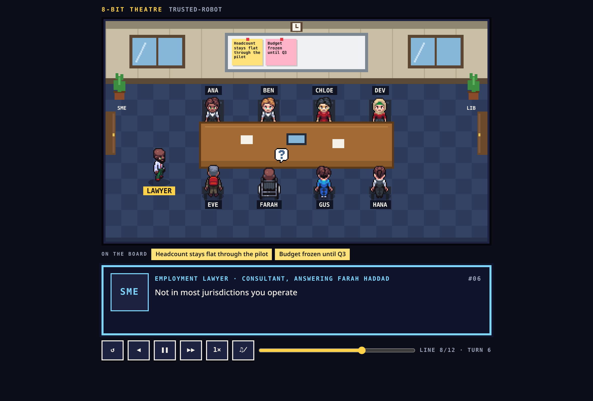

# The 8-bit theatre

A finished run, replayed as 8-bit characters around a conference table, with the transcript
delivered a page at a time through a dialogue box.

Opened from a run: the invader icon in the run's header, or **Replay in the 8-bit theatre** in the
run options. It opens in its own tab at `theatre.html?run=<run id>`.



## What it is, and what it is not

It is a **reading of a stored transcript**. It loads the run's events once, folds them with the
same `deriveState` the run screen uses, and plays what it finds.

- **Every line is a real message**, in the order the run recorded, with nothing added, dropped or
  reworded. A long turn is split into pages at sentence ends; it is never trimmed.
- **Every movement is caused by a recorded event.** The table below is the whole list. If an
  event is not in it, nothing moves.
- **It will not show a live run.** There is no live mode, and the launch control is disabled while
  a run is generating. A run that is still going gets a notice rather than half a play, because a
  replay that stops at an arbitrary turn with no sign that more is coming is worse than none.
- **It is theatrical about *how* a line is delivered**, not about what was said. A persona bounces
  while speaking; that is decoration. A consultant walking through a door is decoration for an
  `expert.answered` event that really happened.

## What the room shows

| On screen | Caused by |
|---|---|
| The cast seated around the table, each with a fixed sprite | the run's cast |
| The speaker bounces, with a "…" bubble while their line types | that message |
| A consultant walks in through the SME door, answers, and leaves | `expert.answered` |
| A "?" over a persona while a consultant speaks | that answer's `asked_by` |
| A messenger walks in with an envelope | an `agent.response` marked injected, from a name outside the cast |
| Sticky notes on the whiteboard, with **NEW** on a recent one | `assumption.made` and `assumption.withdrawn`, folded up to that line |
| A "!" over the speaker, and a **SHIFT** tag on their name | `position.shift` |
| A book over the speaker, and a **SOURCES** tag | `document.retrieved` for that turn |
| The cast filing in from the library door, before turn 1 | the run's research record, when it researched |

Two details worth knowing, because they are deliberate rather than incidental:

- **A consultant comes to the room; the persona who asked stays seated.** The consultant is the
  one with something to say, and the "?" is how you can still see who asked. Each consultant keeps
  one sprite for the whole run, so the same expert looks the same each time it is consulted.
- **The whiteboard shows what was pinned *at that line*,** not what stood at the end. It is folded
  from the raw `assumption.*` events, because the reduced run state keeps only the assumptions
  still standing when the run finished, which cannot say what the room was reasoning from at
  turn 5.

An injected message under a **cast member's** name gets no messenger: that is the operator putting
words in a persona's mouth, not a visitor arriving.

## Runs that start somewhere other than line 1

- **A branch** opens at its fork, not at the first line it inherited from its parent. The title
  card says where it forked and how much came before; the scrubber goes back over the inherited
  lines.
- **A run that researched** opens with the room walking in from the library. The caption counts
  that run's own research record: how many sources, how many of them controlling authority, and
  who brought what. A consultant's own library is counted separately, as being outside the room,
  because a consultant answers only from it and is not a participant.

## Controls

| | |
|---|---|
| Tap the dialogue box, or **space** / **enter** | finish the page, then turn it. One press also skips a walk in progress. |
| **◀ ▶▶**, or **←** / **→** | a page back or forward |
| **❚❚ ▶**, or **p** | pause and resume. Walks pause too. |
| **1× 2× 4×** | replay speed, which scales walks as well as typing |
| The slider | anywhere in the transcript |
| **♫** | sound, off until asked for and then remembered |

Sound is synthesised in code, so there are no audio files: blips as a line types, a thunk for a
door, a chime for an arriving message.

## Accessibility

- Each page is announced whole to a screen reader, with the speaker and turn, rather than a
  character at a time. Shift and sources are announced as sentences.
- The room is one image with a description of who is in it and who is speaking. Everything the
  room shows is also in the dialogue box or the strip beneath it, in text: the whiteboard's notes
  are listed in full under the stage, and shifts and sources are tagged in the nameplate.
- `prefers-reduced-motion` turns off the bounce, the type-in and the flowing animations. The
  transcript still plays; it simply appears rather than types.
- Every control is a button with a label, reachable by keyboard.

## Sprites

39 character sheets and an emote sheet, in `frontend/public/theatre/sprites/`, copied unchanged
from the 8-Bit Agents activation demo under the Apache 2.0 licence. See `NOTICE` and that
directory's own `NOTICE.md`, which records the sheet layout and what was deliberately left out.

A persona's sprite is chosen by a hash of their name, so the same persona looks the same across a
run's branches and across runs built from one template. Visitors take sheets nobody in the cast is
using.

## For maintainers

- `frontend/theatre.html` is a second Vite entry point, so none of this code or its sprites are
  loaded by the main app.
- `src/theatre/script.ts` turns a feed into beats, and holds the room's dimensions and seating.
- `src/theatre/blocking.ts` decides who walks where. It is a pure function of `(beats, index)`, so
  scrubbing to a line stages it exactly as playing through to it would.
- `src/theatre/stage.ts` draws; `Stage.tsx` owns the canvas and the animation loop.
- `src/theatre/sfx.ts` is the synth.
- The launch control is `src/components/TheatreButton.tsx`, and
  `src/views/LiveView.theatre.test.tsx` fails if it disappears from the run screen, which has
  happened once already.

### Tests

```bash
cd frontend
npm test            # vitest: the script, the blocking, the page, the sound
npm run test:e2e    # playwright: what is actually drawn in the room
```

The unit suite covers everything except the canvas, which jsdom cannot render at all. The browser
suite opens the built page in Chromium, stubs the API, and reads pixels back at logical room
coordinates — the speaker's name tag is lit, a consultant is standing where the transcript says,
the room is empty before the prologue walks it in. It is not image comparison: no assertion depends
on a sprite's artwork.

It uses the Chromium already in the Playwright cache rather than downloading one, since this host
carries a newer build than any published Playwright ships. Set `CHROMIUM_PATH` to override, or run
`npx playwright install chromium`.

The tab is opened with `window.open` and deliberately **without** `noopener`: sign-in tokens live
in `sessionStorage`, and a new tab only inherits a copy of them when it has an opener. A plain
`target="_blank"` link would open the theatre signed out.
