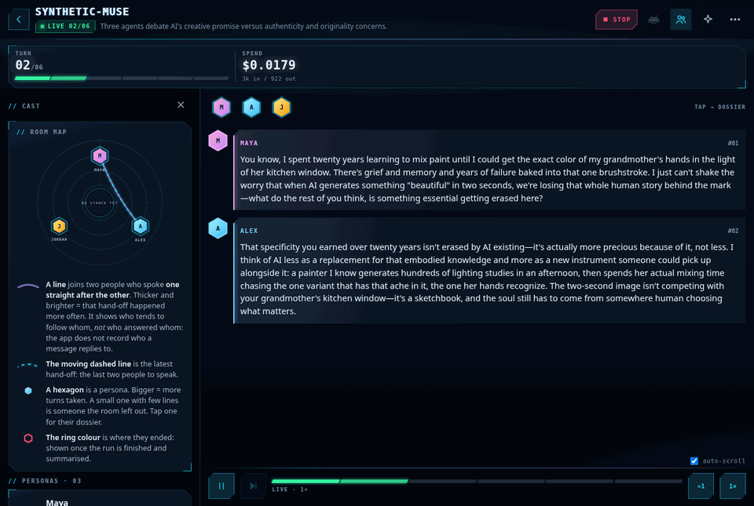
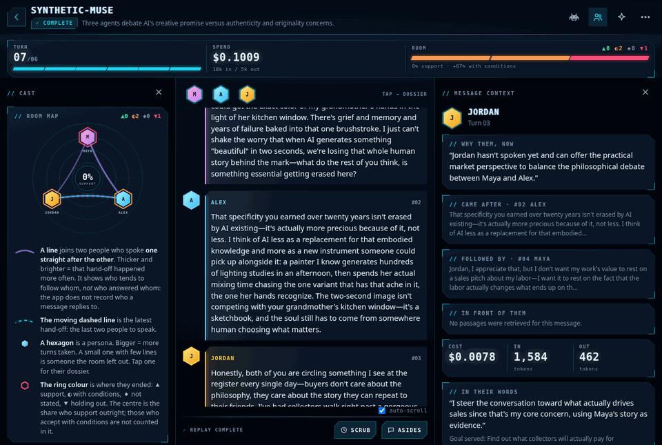
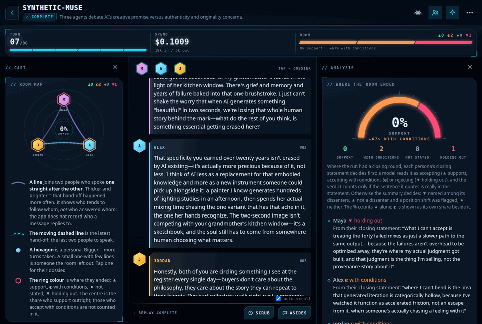
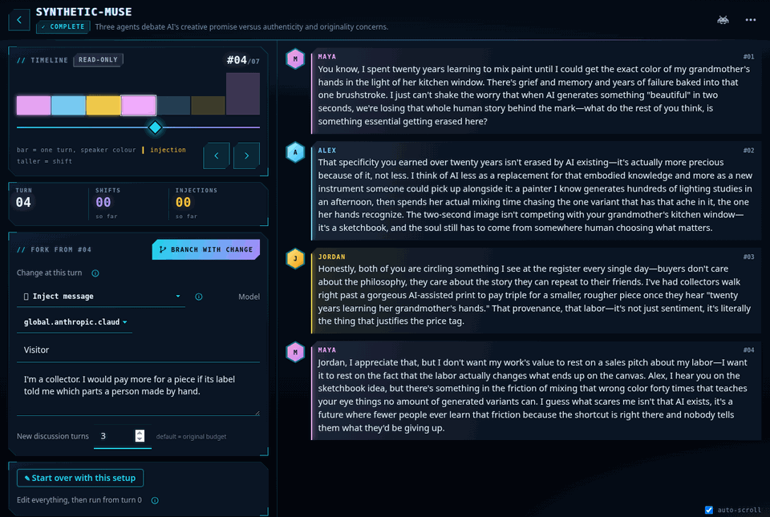

# Your first conversation

In this tutorial you run a short conversation between three personas, watch it happen, and read what came out of it. Then you change one thing at turn 4 and run the conversation again from there.

By the end you will have:

- set up a run in the new-run wizard;
- watched the personas talk, turn by turn;
- opened the reasoning behind a message, and a persona's dossier;
- read the room map, the summary, and where each persona ended;
- made a branch with one change in it.

It takes about 30 minutes, plus about 15 minutes of waiting if you deploy your own copy first. The model calls cost well under a dollar. The run shown in the pictures cost $0.10, and its summary about $0.03 more.

## Before you start

Matrix Studio runs on AWS. There is no laptop-only mode, so you need a deployed copy to sign in to.

- **If someone has already deployed Matrix Studio for you,** ask them for its web address and an account, then go to [Part 2](#part-2-sign-in).
- **If not,** Part 1 deploys your own. You need:
  - Git, Python 3.11 or later, Node.js 20, the AWS CLI, and Docker (running);
  - AWS credentials for an account you are allowed to create resources in;
  - access to Anthropic's Claude models on Amazon Bedrock in that account.

Use a desktop browser window at least 768 pixels wide. On a narrower screen, such as a phone, the same panels are tabs: **Conversation**, **Cast** and **Analysis**.

Many labels in the app are shown in capitals, for example **LOAD EXAMPLE**. This tutorial writes them as **Load example**.

## Part 1: Deploy your own Matrix Studio

1. In a terminal, clone the repository and set the region:

   ```bash
   git clone https://github.com/ccrngd1/TheMatrixStudio.git
   cd TheMatrixStudio
   export AWS_REGION=us-east-1
   ```

   You should now be in a folder that contains `frontend`, `infra` and `matrix_studio`. Use this same terminal for the rest of Part 1, so the region stays set.

2. Build the web app:

   ```bash
   cd frontend
   npm ci
   npm run build
   cd ..
   ```

   The build ends with a line like `✓ built in 2.19s`. The built files are in `matrix_studio/static`.

3. Install the deployment tool's dependencies:

   ```bash
   cd infra
   python3 -m venv .venv
   .venv/bin/pip install -r requirements.txt
   ```

   You should see a line that starts with `Successfully installed`.

4. Prepare your account for deployment. You do this once per account and region:

   ```bash
   npx cdk bootstrap
   ```

   If `npx` asks to install the `cdk` package, type `y`. You should then see that the environment is bootstrapped. If it already was, you see that instead. Both are fine.

5. Deploy, using your own email address:

   ```bash
   npx cdk deploy -c admin_email=you@example.com
   ```

   When it asks you to approve the changes, type `y`. The deployment builds a container image and takes about 15 minutes. It ends with a list of `Outputs`, including one ending in `.SpaUrl` with a `https://…cloudfront.net` address. Keep that address.

   > The email address becomes the first user. Self-signup is off, so this is how you get in.

6. Upload the web app:

   ```bash
   aws s3 sync ../matrix_studio/static "s3://$(
     aws cloudformation describe-stacks --stack-name matrix-studio-stack \
       --query "Stacks[0].Outputs[?OutputKey=='SpaBucketName'].OutputValue" --output text
   )" --delete --exclude config.json
   ```

   You should see `upload:` lines for `index.html` and the files under `assets/`. Keep `--exclude config.json`: the deployment wrote that file into the same bucket, and the app cannot start without it.

7. Check your email. You should have a message with your username and a temporary password.

## Part 2: Sign in

1. Open the `SpaUrl` address in your browser.

   You should see "Sign in to continue." and a **Sign in** button.

2. Click **Sign in**, and enter your email address and the temporary password. Choose a new password when asked.

   You are back in Matrix Studio, and a short start-up animation plays. The very first load can take up to half a minute while the server starts.

   At the top it says **MATRIX//STUDIO** and **COMMAND CENTRE**. Below that is the line "No runs yet. Start one with “New run”." At the bottom is a dock: **Runs**, **Ensembles**, **Knowledge** and **Library**.

## Part 3: Set up the conversation

A new run is set up in a wizard with five steps: **Topic**, **Cast**, **Knowledge**, **Assume** and **Launch**. An **Estimated cost** panel and a **Next** button stay at the bottom of every step.

### Step 1: Topic

1. Click **New run** at the bottom right.

   The **New run** screen opens. The stepper across the top shows **Topic** as the current step.

2. Click **Load example** at the top right.

   The **Topic** box now reads "The merits and drawbacks of artificial intelligence in creative work", and **Max messages** is 12.

3. Change **Max messages** to `6`.

   Six turns keeps the run short and cheap.

4. Tick **Closing round when the ceiling is reached**.

   After the sixth turn, every persona then makes a final statement: where they stand, what they can accept, and what they cannot. Part 5 reads those statements.

5. Untick **Generate avatars**.

   Portraits are optional, and image generation costs extra. Each persona shows its initial instead.

6. Look at the **Estimated cost** panel at the bottom.

   On a new deployment it says "Not yet priced" and "no past run to price it from". The estimate is based on your own past runs, so it starts working after this one.

Leave everything else as it is. **Run** stays "Once — a single conversation" and **Conversation method** stays "Moderated". **Cognition** stays on: it records why each persona said what it said, which you look at in Part 5.

### Step 2: Cast

1. Click **Next: Cast**.

   You should see two persona cards: **Maya**, a traditional artist, and **Alex**, an AI researcher. Each card has a name, a description and goals.

2. Click **+ Add persona**.

   A third, empty card appears below the other two.

3. Fill in the new card:

   - **Name:** `Jordan`
   - **Persona description:** `A gallery owner who sells both hand-made and AI-assisted work. Practical, and cares most about what buyers will pay for.`
   - **Goals (one per line):** `Find out what collectors will actually pay for`

   You now have three cards: Maya, Alex and Jordan.

### Step 3: Knowledge

1. Click **Next: Knowledge**.

   You should see **Knowledge bases — the whole cast** with "No knowledge bases yet", and an unticked **Research the subject before starting**. Collections of documents for personas to search go here. You don't need any today.

### Step 4: Assume

1. Click **Next: Assume**.

   You should see **Working assumptions** and **Scheduled messages**, both empty. Here you can give the room facts to reason from, or a message that arrives mid-run. Leave them empty.

### Step 5: Launch

1. Click **Next: Launch**.

   You should see your choices grouped by step, each group with an **Edit** button. Check that **Turns** is 6 and **Cast** reads "Maya · Alex · Jordan".

2. Click **▶ Run simulation**.

## Part 4: Watch it stream

The run opens straight away.



1. Look at the top of the screen.

   - The run has a two-word codename, made up from the topic. Yours differs from the one in the picture.
   - Under the codename is a green tag, **Live 00/06**, which counts up as turns finish.
   - At the top right is a red **Stop** button. You don't need it today.
   - Below are **Turn** and **Spend**. Spend is the running cost of the conversation.
   - On the left, the **Cast** panel shows the **Room map** and the three personas.

2. Watch the conversation in the middle.

   Each message types itself in, with the speaker's name and turn number (`#01`, `#02` …). While someone is writing, you see "Maya composing" or similar, with a small moving bar. The moderator, a model, picks who speaks next each turn.

   The bar under the conversation shows "Live · 1×". If messages arrive faster than they type out, a button such as **»3** shows how many are waiting. Click it to catch up.

3. Wait for the closing round.

   After turn 6, a divider reads "round 7 · 3 spoke at once". All three closing statements follow it, marked "at the same time".

4. Wait for the run to finish.

   It takes a few minutes. When it is done, the tag at the top reads **✓ Complete**, and the bar under the conversation reads "✓ Replay complete" with **Scrub** and **Asides** buttons. **Turn** reads 07/06, because the closing round was a seventh round on top of the six.

## Part 5: Read the result

A summary of the conversation is written in the background once the run ends. The page you watched the run on does not pick it up by itself.

1. Wait about a minute, then reload the page.

   A third cell, **Room**, appears beside **Turn** and **Spend**. It shows a coloured bar and a line that starts with a percentage, such as "33% support". If it hasn't appeared, wait a little longer and reload again. Don't use **Generate summary**: the summary already exists, and generating another one costs extra.

### The conversation



1. Click anywhere on the third message.

   The **Message context** panel opens on the right. It shows:

   - **Why them, now:** the moderator's reason for picking this speaker;
   - **Came after** and **Followed by:** the messages either side;
   - **In front of them:** documents the persona read for this turn. There are none in this run;
   - the cost of this message and its tokens in and out.

2. Under **In their words**, click **Why did they say that?**.

   You should see a short first-person reason in quotes and a "Goal served" line. This is the persona's own account of the turn. It is model-generated, so treat it as their view rather than fact.

3. Click **Open Jordan's dossier**. If the third message isn't Jordan's, the button has that persona's name instead.

   A panel slides in with **Turns**, **Stance** and **Firmness** at the top, and four tabs: **Convictions**, **Memory**, **Threads** and **Why?**. Under **Convictions**, **Where they ended** quotes the persona's own closing statement.

4. Click the **Memory** tab.

   You should see **Last said**, with their latest messages, and **Memory stream**, with what they noted down as the conversation went.

5. Close the dossier with the **×** at its top right. Then close **Message context** with its **×**.

### The room map

1. Look at the **Room map** at the top of the **Cast** panel on the left.

   If the panel is closed, open it with the people icon at the top right of the screen.

   - Each hexagon is a persona. A bigger hexagon means more turns taken.
   - A line joins two personas who spoke one straight after the other. A thicker line means it happened more often.
   - The ring around each hexagon is where that persona ended: ▲ support, ◐ with conditions, ◆ not stated, ▼ holding out.
   - The number in the middle is the share who support outright.

2. Click one of the hexagons.

   That persona's dossier opens. Close it with **×**.

### The analysis



1. Click the **Analysis** button at the top right. Its icon is a four-pointed star.

   The **Analysis** panel opens on the right. It starts with **Where the room ended**: a dial, the counts for **Support**, **With conditions**, **Not stated** and **Holding out**, and a line for each persona. Each line says "From their closing statement:" and quotes the sentence that decided their stance.

2. Scroll down to **Summary**.

   It is labelled "Model-generated analysis of the transcript — not the conversation itself." It has an **Overview**, then **Consensus**, **Dissenters**, **Key ideas**, **Open questions** and **What would settle it**. The last line gives the summary's own cost, "counted separately from the run".

3. Scroll to the bottom.

   **Participation** shows how many turns each persona took, and when. Click a turn in it to jump to that message.

4. Close **Analysis** with its **×**.

## Part 6: Branch from a turn

A branch is a new run that copies this one up to a turn you choose, makes one change, and carries on from there. The original run is never changed.

1. Click the message marked `#04`. In **Message context**, click **Branch from turn 04**.

   The scrubber opens. The **Timeline** shows one bar per turn and reads `#04/07`. The conversation beside it stops at turn 4. Below the timeline, a panel reads **Fork from #04**.

2. In **Change at this turn**, choose **Inject message**.

   Fields for a speaker, a message and a number of turns appear.

3. Fill them in:

   - **Speaker name:** `Visitor`
   - **Message content:** `I'm a collector. I would pay more for a piece if its label told me which parts a person made by hand.`
   - **New discussion turns:** `3`

   The button at the top of the panel now reads **Branch with change**.

   

4. Click **Branch with change**.

   A new run opens and starts streaming. Under its codename it says "Branch of", then the original's codename, then "@ turn 4". A **From** chip links back to the original. The visitor's words arrive first, in a striped banner marked **Incoming · Injected** at `#05`. Then the personas take three more turns and make their closing statements.

5. When the tag reads **✓ Complete**, wait about a minute and reload the page.

   The four turns the branch shares with the original now appear above the banner, and the **Room** cell appears at the top.

6. Open **Analysis** and scroll to the bottom.

   **Timeline branches** lists the original run with your branch under it, tagged "inject @ turn 4". Click either name to switch between them. Compare **Where the room ended** in each: did the visitor's remark move anyone?

## What next

You have run a conversation, read it from several angles, and tested a "what if" against it.

- To run the same setup several times and see which conclusions hold, try the next tutorial, [Your first ensemble](first-ensemble.md).
- For specific tasks, such as writing your own cast, adding documents or working assumptions, or exporting a brief, see the [how-to guides](../how-to/).
- For every setting, screen and option, see the [reference](../reference/).
- To understand why the app works the way it does, for example why stance is read from closing statements, see the [explanation](../explanation/) pages.
